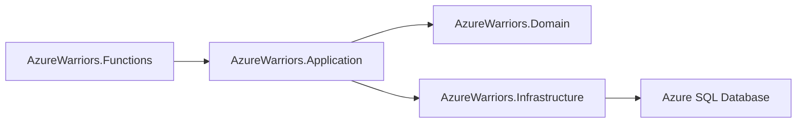
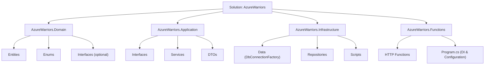
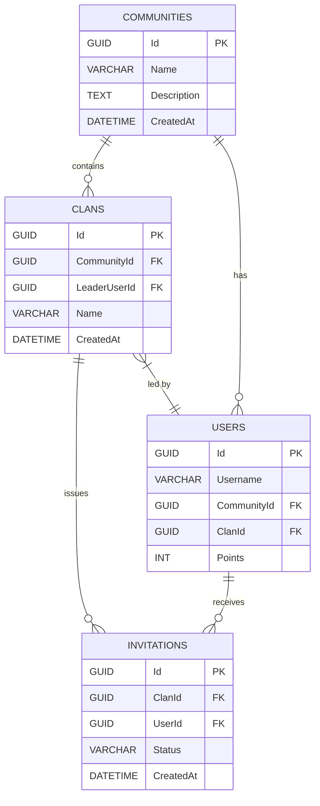
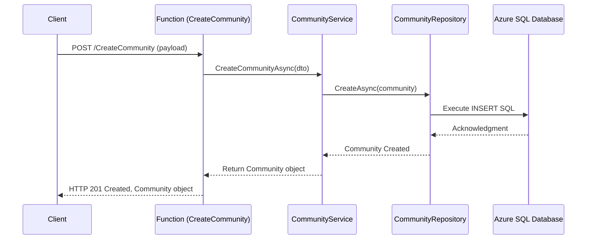

# AzureWarriors - Project Documentation

AzureWarriors is a serverless system built using **.NET 8** with **Azure Functions (Isolated Worker)** to expose HTTP endpoints, **Dapper** for high-performance access to an **Azure SQL Database**, and a layered architecture to organize responsibilities.  
The system manages communities, clans, and invitations with business rules such as:

- Each user can belong to only one community and one clan at a time.
- When a user switches communities/clans, their points are reset.
- Each clan has a designated leader.

---

## Table of Contents

- [AzureWarriors - Project Documentation](#azurewarriors---project-documentation)
  - [Table of Contents](#table-of-contents)
  - [Technologies Used](#technologies-used)
  - [Project Architecture](#project-architecture)
    - [Overall Architecture Diagram](#overall-architecture-diagram)
  - [Solution Structure](#solution-structure)
  - [Entity Relationship Diagram (ER Diagram)](#entity-relationship-diagram-er-diagram)
  - [Sequence Diagram](#sequence-diagram)
  - [Configuration and Deployment](#configuration-and-deployment)
    - [Environment Variables](#environment-variables)
    - [Deployment](#deployment)
  - [API Endpoints](#api-endpoints)
  - [Contact](#contact)

---

## Technologies Used

- **.NET 8**
- **Azure Functions (Isolated Worker)**
- **Azure SQL Database**
- **Dapper** for database access
- **Visual Studio 2022** (or later)
- **Azure Functions Core Tools**
- **Azure Portal** for managing the Function App and database
- **Postman** for API testing

---

## Project Architecture

The project follows a layered architecture, dividing responsibilities into four main projects:

- **AzureWarriors.Domain**  
  Contains the domain entities, enums, and optionally interfaces for marking aggregates.

- **AzureWarriors.Application**  
  Handles business rules, defines repository interfaces, services, DTOs, and use cases.

- **AzureWarriors.Infrastructure**  
  Implements data access using Dapper. It includes repositories, a connection factory, and SQL scripts to create the database schema.

- **AzureWarriors.Functions**  
  Exposes HTTP endpoints via Azure Functions. This layer injects and uses the services from the Application layer and serves as the entry point of the system.

### Overall Architecture Diagram



---

## Solution Structure

The solution is organized as follows:



---

## Entity Relationship Diagram (ER Diagram)

Below is the ER diagram representing the main tables of the system and their relationships:



---

## Sequence Diagram

The following sequence diagram illustrates the flow for creating a community:



---

## Configuration and Deployment

### Environment Variables

- **Locally:**  
  Use the `local.settings.json` file to define environment variables. For example:

  ```json
  {
    "IsEncrypted": false,
    "Values": {
      "AzureWebJobsStorage": "UseDevelopmentStorage=true",
      "FUNCTIONS_WORKER_RUNTIME": "dotnet-isolated"
    },
    "ConnectionStrings": {
      "SqlConnection": "Server=tcp:YOUR_SERVER.database.windows.net,1433;Database=AzureWarriorsDB;User ID=YourUser;Password=YourPassword;Encrypt=True;TrustServerCertificate=False;Connection Timeout=30;"
    }
  }
  ```

- **On Azure:**  
  In the Azure Portal, navigate to your Function App and configure the **Application Settings** or **Connection Strings** with the same key name (`SqlConnection`).

### Deployment

1. Set the **AzureWarriors.Functions** project as the Startup Project.
2. Use Visual Studio's **Publish** feature to deploy your Function App to Azure.
3. Update Application Settings as needed in the Azure Portal.
4. Test the endpoints using your Function App URL (include the function key if required).

---

## API Endpoints

You can import the following **Postman Collection** to test the endpoints:

```json
{
  "info": {
    "_postman_id": "aedfe2c7-0000-4d30-86a6-999999999999",
    "name": "AzureWarriors API",
    "description": "Postman collection for testing AzureWarriors.Functions endpoints",
    "schema": "https://schema.getpostman.com/json/collection/v2.1.0/collection.json"
  },
  "item": [
    {
      "name": "CreateUser",
      "request": {
        "method": "POST",
        "header": [{ "key": "Content-Type", "value": "application/json" }],
        "body": {
          "mode": "raw",
          "raw": "{\n  \"username\": \"JohnDoe\"\n}"
        },
        "url": {
          "raw": "http://localhost:7071/api/CreateUser",
          "protocol": "http",
          "host": ["localhost"],
          "port": "7071",
          "path": ["api", "CreateUser"]
        }
      }
    },
    {
      "name": "CreateCommunity",
      "request": {
        "method": "POST",
        "header": [{ "key": "Content-Type", "value": "application/json" }],
        "body": {
          "mode": "raw",
          "raw": "{\n  \"name\": \"My Community\",\n  \"description\": \"Description of my community\"\n}"
        },
        "url": {
          "raw": "http://localhost:7071/api/CreateCommunity",
          "protocol": "http",
          "host": ["localhost"],
          "port": "7071",
          "path": ["api", "CreateCommunity"]
        }
      }
    },
    {
      "name": "GetCommunity",
      "request": {
        "method": "GET",
        "header": [],
        "url": {
          "raw": "http://localhost:7071/api/GetCommunity/{{communityId}}",
          "protocol": "http",
          "host": ["localhost"],
          "port": "7071",
          "path": ["api", "GetCommunity", "{{communityId}}"]
        }
      }
    },
    {
      "name": "JoinCommunity",
      "request": {
        "method": "POST",
        "header": [{ "key": "Content-Type", "value": "application/json" }],
        "body": {
          "mode": "raw",
          "raw": "{\n  \"userId\": \"{{userId}}\",\n  \"communityId\": \"{{communityId}}\"\n}"
        },
        "url": {
          "raw": "http://localhost:7071/api/JoinCommunity",
          "protocol": "http",
          "host": ["localhost"],
          "port": "7071",
          "path": ["api", "JoinCommunity"]
        }
      }
    },
    {
      "name": "CreateClan",
      "request": {
        "method": "POST",
        "header": [{ "key": "Content-Type", "value": "application/json" }],
        "body": {
          "mode": "raw",
          "raw": "{\n  \"communityId\": \"{{communityId}}\",\n  \"leaderUserId\": \"{{leaderUserId}}\",\n  \"clanName\": \"WarriorsClan\"\n}"
        },
        "url": {
          "raw": "http://localhost:7071/api/CreateClan",
          "protocol": "http",
          "host": ["localhost"],
          "port": "7071",
          "path": ["api", "CreateClan"]
        }
      }
    },
    {
      "name": "GetClan",
      "request": {
        "method": "GET",
        "header": [],
        "url": {
          "raw": "http://localhost:7071/api/GetClan/{{clanId}}",
          "protocol": "http",
          "host": ["localhost"],
          "port": "7071",
          "path": ["api", "GetClan", "{{clanId}}"]
        }
      }
    },
    {
      "name": "JoinClan",
      "request": {
        "method": "POST",
        "header": [{ "key": "Content-Type", "value": "application/json" }],
        "body": {
          "mode": "raw",
          "raw": "{\n  \"userId\": \"{{userId}}\",\n  \"clanId\": \"{{clanId}}\"\n}"
        },
        "url": {
          "raw": "http://localhost:7071/api/JoinClan",
          "protocol": "http",
          "host": ["localhost"],
          "port": "7071",
          "path": ["api", "JoinClan"]
        }
      }
    },
    {
      "name": "LeaveClan",
      "request": {
        "method": "POST",
        "header": [{ "key": "Content-Type", "value": "application/json" }],
        "body": {
          "mode": "raw",
          "raw": "{\n  \"userId\": \"{{userId}}\"\n}"
        },
        "url": {
          "raw": "http://localhost:7071/api/LeaveClan",
          "protocol": "http",
          "host": ["localhost"],
          "port": "7071",
          "path": ["api", "LeaveClan"]
        }
      }
    },
    {
      "name": "KickMember",
      "request": {
        "method": "POST",
        "header": [{ "key": "Content-Type", "value": "application/json" }],
        "body": {
          "mode": "raw",
          "raw": "{\n  \"clanId\": \"{{clanId}}\",\n  \"leaderUserId\": \"{{leaderUserId}}\",\n  \"targetUserId\": \"{{targetUserId}}\"\n}"
        },
        "url": {
          "raw": "http://localhost:7071/api/KickMember",
          "protocol": "http",
          "host": ["localhost"],
          "port": "7071",
          "path": ["api", "KickMember"]
        }
      }
    },
    {
      "name": "InviteToClan",
      "request": {
        "method": "POST",
        "header": [{ "key": "Content-Type", "value": "application/json" }],
        "body": {
          "mode": "raw",
          "raw": "{\n  \"clanId\": \"{{clanId}}\",\n  \"userId\": \"{{userId}}\"\n}"
        },
        "url": {
          "raw": "http://localhost:7071/api/InviteToClan",
          "protocol": "http",
          "host": ["localhost"],
          "port": "7071",
          "path": ["api", "InviteToClan"]
        }
      }
    },
    {
      "name": "RespondInvitation",
      "request": {
        "method": "POST",
        "header": [{ "key": "Content-Type", "value": "application/json" }],
        "body": {
          "mode": "raw",
          "raw": "{\n  \"invitationId\": \"{{invitationId}}\",\n  \"accept\": true\n}"
        },
        "url": {
          "raw": "http://localhost:7071/api/RespondInvitation",
          "protocol": "http",
          "host": ["localhost"],
          "port": "7071",
          "path": ["api", "RespondInvitation"]
        }
      }
    }
  ]
}
```

## Contact

For any questions or suggestions, please contact <miqueias.dev@gmail.com>.

*This documentation provides a complete overview of the AzureWarriors project, its technologies, architecture, database schema, key flows, and API endpoints, along with diagrams generated using Mermaid. Adjust the contact details and other specific information as needed for your project.*
