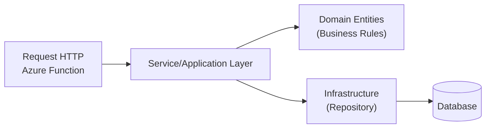
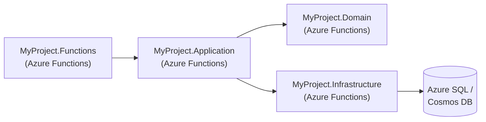

# Análises

## 1. Que tipo de projeto é esse que eles querem que desenvolva e qual é o nome técnico para esse tipo de projeto?

Eles pedem a criação de endpoints para gerenciar Comunidades, Clans e Ranking, implementados como Azure Functions em .NET. Na prática, é um "Backend Serverless" — ou seja, um backend que roda em uma arquitetura sem servidor (serverless) usando Azure Functions para expor APIs RESTful.

Em termos de definição mais técnica, posso chamar este tipo de solução de:

- `Serverless HTTP API` em Azure Functions.
- Ou `Serverless Microservices` (caso o projeto seja organizado em múltiplas funções que atuam como pequenos serviços).

Dada a ênfase nos endpoints e na lógica de negócios dentro de um ambiente escalável, a nomenclatura mais direta deve ser **Backend Serverless em Azure Functions**.

## 2. Que modelo de arquitetura posso usar para a implementação da Parte 2?

Para a Parte 2 (o projeto que envolve criar do zero o sistema de comunidades, clans e ranking), acho melhor uma arquitetura em camadas (Layered Architecture) ou uma variação de Clean Architecture, mesmo em um contexto serverless. Assim, ainda que as funções (Azure Functions) sejam stateless e independentes, mantemos uma organização clara das responsabilidades.

### Camadas (visão simplificada)

1. Azure Functions (Interface HTTP)
   - Onde estarão as triggers HTTP, que recebem as requisições REST.
   - Mínima lógica de negócio; concentra a orquestração para chamar os serviços de aplicação.
1. Application / Service Layer (Regras de Negócio e Casos de Uso)
   - Contém a lógica de negócio (por exemplo, JoinClan, InviteToClan, KickMember).
   - Validações de regras e orquestração de chamadas ao repositório.
1. Domain / Core Layer (Entidades e Regras de Domínio)
   - Entidades fundamentais (Comunidade, Clan, User, Ranking).
   - Regras puras de domínio, sem dependências de infraestrutura.
1. Infrastructure / Data Layer
   - Repositórios que acessam o banco de dados (Azure SQL ou Cosmos DB).
   - Configurações de conexões, mapeamentos etc.

Em termos práticos, cada endpoint HTTP (função) chamaria um **serviço** ou **caso de uso** que, por sua vez, interage com o domínio e depois acessa o repositório para persistir/consultar dados.

#### Fluxograma Simplificado da Arquitetura em Camadas

#### Explicação do Fluxo

1. A chamada HTTP chega na Azure Function (A).
1. A Function chama a camada de serviço (B) para processar a lógica de negócio.
1. O serviço utiliza as Entidades de Domínio (C) para encapsular regras específicas (como validar se o usuário já pertence a outra comunidade).
1. Se precisar persistir dados, o serviço chama o Repository (D).
1. O repositório, por sua vez, acessa o Banco de Dados (E).

---

## 3. Que modelo de projeto devo usar para a implementação da Parte 2?

Então dada a analise do modelo de arquitetura, posso organizar uma **Solution** com múltiplos projetos, por exemplo:

1. **MyProject.Functions**
   - Onde ficam as Azure Functions (cada método HTTP Trigger em um arquivo/função separado ou agrupados por domínio).

2. **MyProject.Application**  
   - Camada de serviços e casos de uso (JoinClanService, CreateCommunityService, etc.).  
   - Contém DTOs de entrada/saída e orquestra a lógica do domínio.  

3. **MyProject.Domain**  
   - Classes de domínio: Community, Clan, User, Ranking, convites etc.  
   - Regras de negócio, validações e invariantes de domínio.  

4. **MyProject.Infrastructure**  
   - Classes de repositório (por exemplo, Entity Framework para Azure SQL ou SDK do Cosmos DB).  
   - *Migrations, contextos de banco, configurações de conexão.  

### Fluxograma Simplificado do Modelo de Projeto

**Explicação do Fluxo**  

1. **MyProject.Functions**: ponto de entrada da aplicação (HTTP Trigger).  
2. **MyProject.Application**: coordena a lógica de negócio e chama tanto o domínio quanto a camada de infraestrutura para persistência.  
3. **MyProject.Domain**: contém as regras centrais e entidades.  
4. **MyProject.Infrastructure**: implementa o acesso aos dados e outras integrações externas.  
5. O banco de dados, seja SQL ou Cosmos DB, é acessado apenas pela camada de infraestrutura.

---

## O que posso fazer de diferente??

Para além do **básico** pedido (endpoints + lógica mínima de ranking), poderia incluir:  

1. **Documentação via Swagger/OpenAPI**: Facilita o teste e a compreensão dos endpoints.  
2. **Automated Tests** (xUnit, MSTest ou NUnit) em projetos separados para validar regras de negócio críticas.  
3. **Segurança mínima**: Por exemplo, JWT Bearer Token para ilustrar um fluxo de autenticação, mesmo que seja algo simples ou mocked.  
4. ***CI/CD** simples no Azure DevOps ou GitHub Actions, mostrando como fazer o deploy automatizado das Azure Functions.  
5. ***Observabilidade**: Integração com Azure Application Insights para ter logs e métricas dos endpoints.  

Isso demonstraria **boa visão de arquitetura** e atenção a detalhes que geralmente são exigidos em projetos de produção.

---

## Conclusão

Eles estão pedindo um **backend serverless** em .NET com Azure Functions, cujo foco é gerenciar entidades (Comunidades, Clans, Ranking) de forma escalável. Um **modelo de arquitetura em camadas** ou uma **variação de Clean Architecture** é ideal para manter a aplicação organizada e preparada para evolução. Uma **Solution** com projetos separados para Functions, Application, Domain e Infrastructure garante separação de responsabilidades e clareza no código.

Vamo lá!!!
