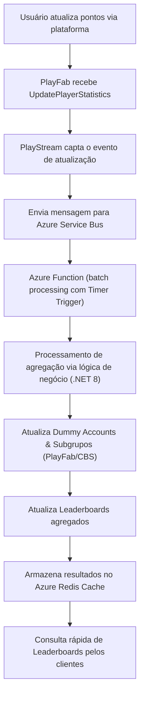
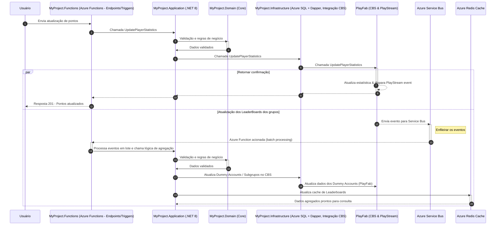

# Proposta Técnica: Social Module – Guild/Clan Management e Leaderboards

Esta proposta visa apresentar uma solução robusta para os desafios do seu projeto, que envolve a implementação de dois submódulos críticos – **Guild/Clan Management** e **Leaderboards** – em uma plataforma de Game BaaS. A arquitetura emprega CBS (PlayFab), Azure Functions com Timer Trigger, .NET 8 e Azure SQL com Dapper, além da integração com serviços do Azure (Service Bus, Redis Cache) para otimização de custos, tráfego, latência e controle de concorrência.

---

## 1. Visão Geral do Projeto

- **Objetivo:**  
  Construir um Social Module que gerencie guildas/clãs e leaderboards de forma escalável e com baixa latência, mesmo para cenários onde grupos (clãs) podem chegar a 30.000 jogadores.

- **Contexto:**  
  Atualmente, o PlayFab limita grupos a 1000 membros. Para atender à expectativa de 30.000 membros, a solução propõe:
  - **Dummy Accounts:** Contas dummy representam os agregados (subgrupos, clãs e comunidades) para viabilizar a atualização de leaderboards.
  - **Subgrupos:** Criação de subgrupos para particionar o grupo gigante em segmentos menores, cada um com suas associações e campos customizados para identificação.

- **Plataforma Tecnológica:**  
  - **CBS (PlayFab):** Para gerenciamento de estatísticas e eventos (PlayStream).  
  - **Azure Functions (com Timer Trigger):** Para orquestração, processamento em lote e execução de lógicas assíncronas.  
  - **.NET 8:** Linguagem e framework para implementação dos serviços de negócio.  
  - **Azure SQL com Dapper:** Para persistência de dados com alta performance.  
  - **Azure Service Bus:** Para enfileiramento de eventos e redução de picos de tráfego.  
  - **Azure Redis Cache:** Para cache inteligente e redução de latência nas consultas.

---

## 2. Problemas Identificados

- **Limite de Membros no PlayFab:**  
  - O PlayFab impõe um limite de 1000 usuários por grupo.  
  - Necessidade de suportar 30.000 usuários por grupo.

- **Custos e Tráfego na Nuvem:**  
  - Elevado volume de atualizações pode aumentar o tráfego e os custos das chamadas diretas ao PlayFab e demais serviços.
  - Necessidade de reduzir chamadas diretas e otimizar a transferência de dados entre serviços.

- **Latência e Concorrência:**  
  - Atualizações assíncronas podem introduzir latência.  
  - Atualizações concorrentes exigem mecanismos robustos para evitar conflitos e reprocessamentos, aumentando assim também a complexidade.

---

## 3. Solução Proposta

### Abordagem para Ranking e Agregação de Dados

- **Dummy Accounts e Subgrupos:**  
  - Dividir um grupo gigante (até 30.000 jogadores) em múltiplos subgrupos menores.
  - Cada subgrupo é representado por uma dummy account cuja estatística agregada é utilizada para compor o ranking do clã/comunidade.

- **Processamento Assíncrono e Batch (Debouncing):**  
  - Utilizar o PlayStream para capturar eventos de atualização de estatísticas.
  - Enfileirar esses eventos no **Azure Service Bus** e processá-los em lote através de **Azure Functions** com Timer Trigger, minimizando chamadas repetitivas ao CloudScript.
  - Atualizar os dummy accounts e os leaderboards de forma agregada.

- **Uso de Cache Distribuído:**  
  - Implementar o **Azure Redis Cache** para armazenar temporariamente os resultados agregados dos leaderboards, reduzindo a carga nas consultas diretas e melhorando a latência.

- **Controle de Concorrência e Operações Atômicas:**  
  - Adotar mecanismos de controle (otimistic concurrency, versionamento e comandos atômicos no Redis) para garantir atualizações consistentes e reduzir reprocessamentos.

### Estratégias para Redução de Custos e Tráfego

- **Redução de Execuções:**  
  - Processamento em lote para diminuir chamadas ao CloudScript e ao Service Bus.
- **Custos Otimizados:**  
  - Uso do modelo de consumo do Azure Functions, pagando somente pelo que é utilizado.
- **Tráfego Reduzido:**  
  - Centralização da lógica e cache inteligente para reduzir a transferência de dados entre os serviços.
- **Melhor Controle de Concorrência:**  
  - Mecanismos atômicos e versionamento para evitar conflitos e reprocessamentos desnecessários.

---

## 4. Arquitetura em Camadas do Projeto

A arquitetura adota o padrão **Layered Architecture**:

- **MyProject.Functions (Interface HTTP/Triggers):**  
  - Exposição de endpoints HTTP e triggers (ex: Timer Trigger) do Azure Functions.  
  - Porta de entrada para as requisições externas e orquestração inicial dos eventos.

- **MyProject.Application (Application/Service Layer):**  
  - Contém as regras de negócio e casos de uso da aplicação.  
  - Responsável por orquestrar operações entre o domínio e a infraestrutura.

- **MyProject.Domain (Domain/Core Layer):**  
  - Núcleo do sistema com entidades, agregados e regras de domínio.  
  - Implementa a lógica de negócio fundamental de forma independente de tecnologias externas.

- **MyProject.Infrastructure (Infrastructure/Data Layer):**  
  - Implementação dos mecanismos de persistência (Azure SQL com Dapper) e integrações com serviços externos (CBS/PlayFab, Azure Service Bus, Azure Redis Cache).  
  - Responsável por comunicação e operações de CRUD com alta performance.

---

## 5. Fluxo de Atualização de Rankings – Diagrama de Fluxo

---

## 6. Fluxo de Atualização de Rankings Completo – Diagrama de Sequência

---

## 7. Conclusão

A solução proposta aborda os principais desafios identificados:

- **Superação do Limite de 1000 Usuários por Grupo:**  
  Por meio da criação de subgrupos e dummy accounts, conseguimos particionar um grupo de até 30.000 usuários, mantendo a integridade dos dados e facilitando a agregação dos rankings.

- **Redução de Custos e Tráfego:**  
  O processamento em lote via Azure Functions, aliado ao uso do Azure Service Bus e Azure Redis Cache, diminui o número de chamadas diretas ao PlayFab e ao CloudScript, reduzindo custos operacionais e o tráfego entre serviços.

- **Controle de Concorrência e Latência:**  
  A implementação de mecanismos atômicos e estratégias de versionamento garante a consistência dos dados, enquanto o processamento assíncrono e o cache inteligente minimizam a latência percebida pelo usuário.

- **Arquitetura em Camadas:**  
  A separação em camadas (Functions, Application, Domain e Infrastructure) promove a manutenção, escalabilidade e modularidade do sistema, facilitando a evolução da plataforma e a integração com novos serviços conforme necessário.

Esta proposta técnica representa uma solução escalável, eficiente e economicamente viável para a implementação dos submódulos de Guild/Clan Management e Leaderboards, atendendo aos requisitos de alta performance e integridade de dados para o seu projeto.
