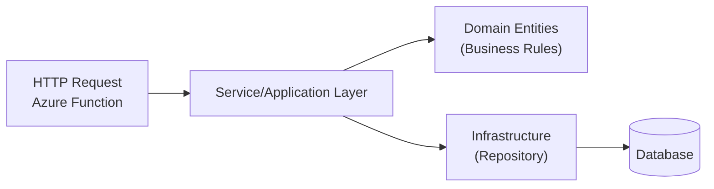
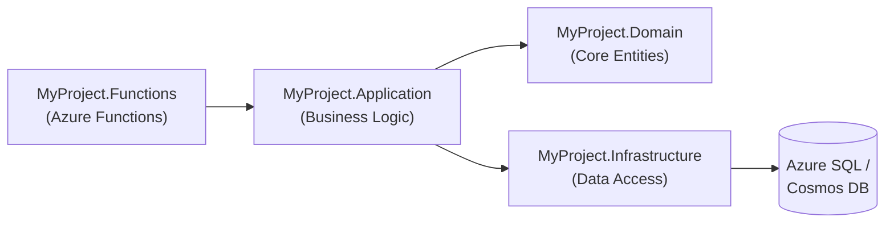

# Analyses

## 1. What Type of Project Are They Asking to Develop and What is the Technical Name for This Kind of Project?

They are asking for the creation of endpoints to manage Communities, Clans, and Ranking, implemented as Azure Functions in .NET. In practice, this is a **Serverless Backend**—that is, a backend running on a serverless architecture using Azure Functions to expose RESTful APIs.

In more technical terms, this type of solution can be called:

- A `Serverless HTTP API` built with Azure Functions.
- Or `Serverless Microservices` (if the project is organized as multiple functions acting as small services).

Given the emphasis on endpoints and business logic within a scalable environment, the most direct nomenclature is **Serverless Backend using Azure Functions**.

---

## 2. What Architecture Model Can I Use for the Implementation of Part 2?

For Part 2 (the project that involves building from scratch the system for communities, clans, and ranking), a layered architecture (Layered Architecture) or a variation of Clean Architecture is recommended, even in a serverless context. This way, although the functions (Azure Functions) are stateless and independent, we still maintain a clear separation of responsibilities.

### Layers (Simplified View)

1. **Azure Functions (HTTP Interface)**
   - Where the HTTP triggers reside, receiving REST requests.
   - Contains minimal business logic; primarily orchestrates calls to application services.

2. **Application / Service Layer (Business Rules and Use Cases)**
   - Contains the business logic (e.g., JoinClan, InviteToClan, KickMember).
   - Performs rule validations and orchestrates calls to the repository.

3. **Domain / Core Layer (Domain Entities and Rules)**
   - Fundamental entities (Community, Clan, User, Ranking).
   - Pure domain rules, free from infrastructure dependencies.

4. **Infrastructure / Data Layer**
   - Repositories that access the database (Azure SQL or Cosmos DB).
   - Handles connection configurations, mappings, etc.

In practical terms, each HTTP endpoint (function) would call a **service** or **use case** that, in turn, interacts with the domain and then accesses the repository to persist or retrieve data.

#### Simplified Flowchart of the Layered Architecture

#### Explanation of the Flow

1. The HTTP call arrives at the Azure Function (A).
2. The Function calls the service layer (B) to process the business logic.
3. The service uses the Domain Entities (C) to encapsulate specific rules (e.g., validating if the user already belongs to another community).
4. If data persistence is needed, the service calls the Repository (D).
5. The repository, in turn, accesses the Database (E).

---

## 3. What Project Model Should I Use for the Implementation of Part 2?

Based on the analysis of the architecture model, you can organize a **Solution** with multiple projects, for example:

1. **MyProject.Functions**
   - Contains the Azure Functions (each HTTP Trigger method can be in a separate file/function or grouped by domain).

2. **MyProject.Application**  
   - The layer of services and use cases (e.g., JoinClanService, CreateCommunityService, etc.).  
   - Contains input/output DTOs and orchestrates the domain logic.

3. **MyProject.Domain**  
   - Domain classes: Community, Clan, User, Ranking, invitations, etc.  
   - Contains business rules, validations, and domain invariants.

4. **MyProject.Infrastructure**  
   - Repository classes (for example, using Entity Framework for Azure SQL or the Cosmos DB SDK).  
   - Contains migrations, database contexts, and connection configurations.

### Simplified Flowchart of the Project Model

**Flow Explanation**  

1. **MyProject.Functions**: The entry point of the application (HTTP Triggers).  
2. **MyProject.Application**: Coordinates the business logic and calls both the domain layer and the infrastructure layer for data persistence.  
3. **MyProject.Domain**: Contains the core rules and entities.  
4. **MyProject.Infrastructure**: Implements data access and other external integrations.  
5. The database, whether SQL or Cosmos DB, is accessed only by the infrastructure layer.

---

## What Can I Do Differently?

Beyond the **basic** requirements (endpoints + minimal ranking logic), you could add:

1. **Swagger/OpenAPI Documentation**: Makes testing and understanding the endpoints easier.
2. **Automated Tests** (xUnit, MSTest, or NUnit) in separate projects to validate critical business rules.
3. **Basic Security**: For example, a JWT Bearer Token to illustrate an authentication flow, even if it’s simple or mocked.
4. A simple **CI/CD** pipeline using Azure DevOps or GitHub Actions, showing how to automate the deployment of the Azure Functions.
5. **Observability**: Integration with Azure Application Insights to capture logs and metrics from the endpoints.

These additions would demonstrate a **solid architectural vision** and attention to details that are typically required in production-level projects.

---

## Conclusion

They are asking for a **serverless backend** in .NET using Azure Functions, focused on managing entities (Communities, Clans, Ranking) in a scalable manner. A **layered architecture** model or a **variation of Clean Architecture** is ideal to keep the application organized and ready for evolution. A **Solution** with separate projects for Functions, Application, Domain, and Infrastructure ensures a clear separation of concerns and code clarity.

Let's get started!!!
