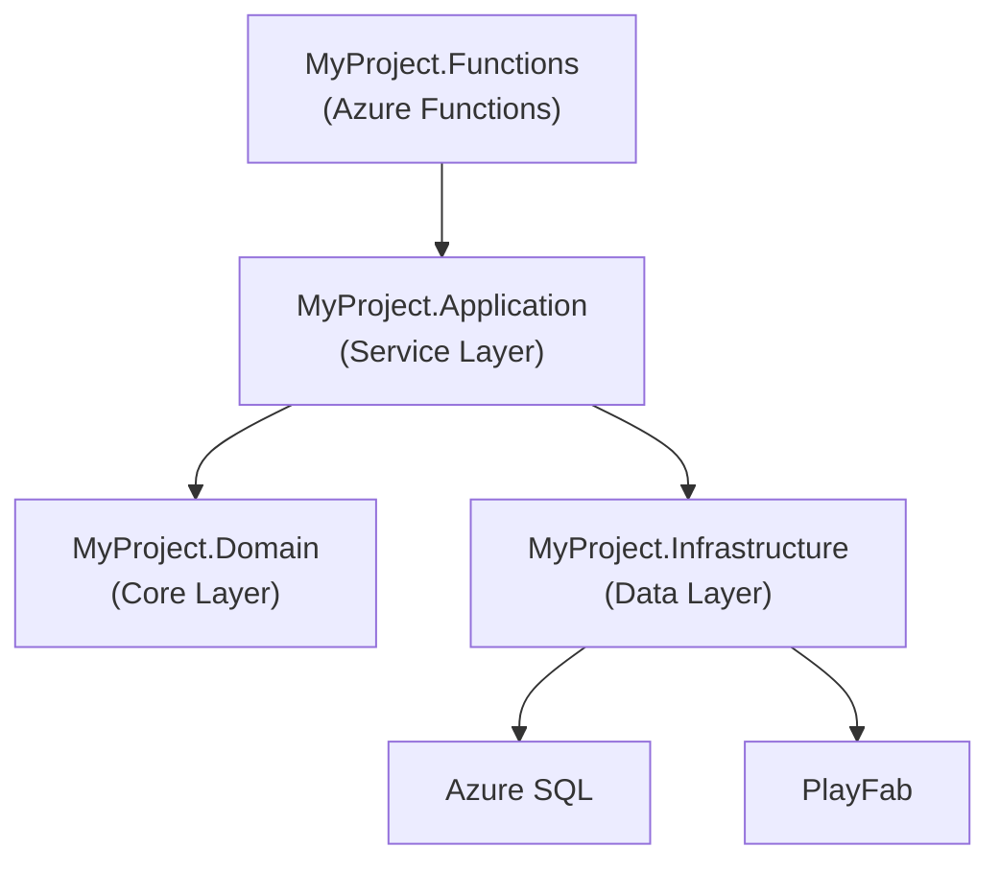
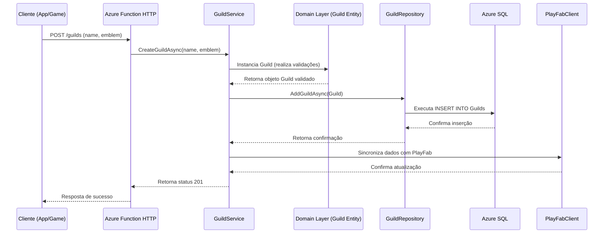
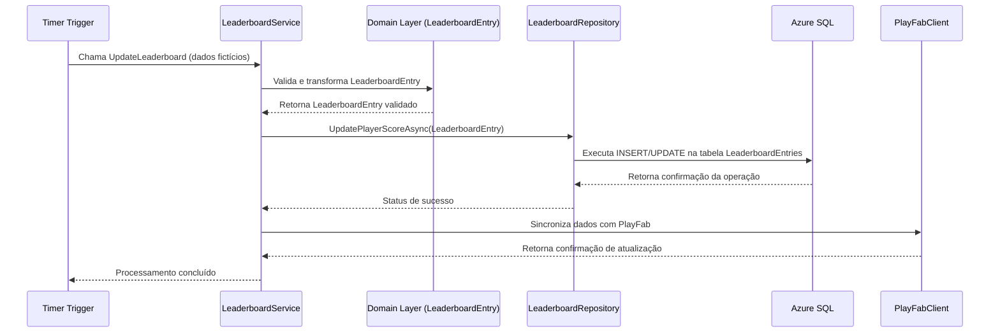
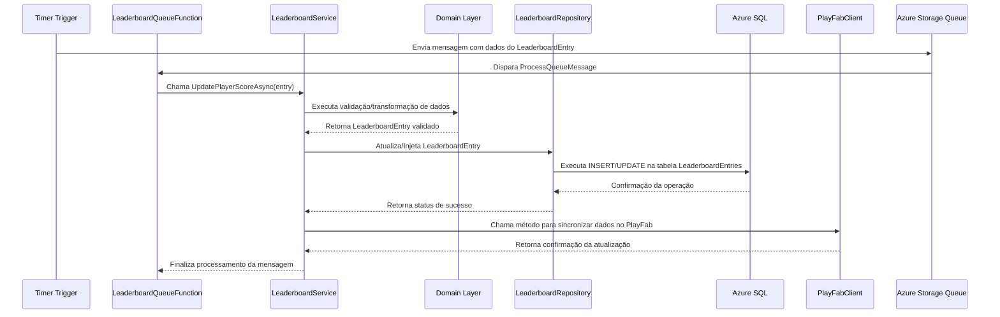

# Desenvolvimento de Componentes Guild/Clan Management e Leaderboards em uma Plataforma de Game BaaS com .NET 8 com Azure

Este artigo tem como objetivo abordar, de forma aprofundada e prática, os submódulos de **Guild/Clan Management** e **Leaderboards** que compõem um módulo social dentro de uma plataforma de Game BaaS (Backend as a Service). Através deste conteúdo, abordaremos desde os conceitos fundamentais e a arquitetura de um sistema distribuído utilizando .NET 8, Azure Functions, Timer Trigger, PlayFab e Azure SQL com Dapper, até a implementação prática de código-fonte em C#. Para aqueles que desejam compreender tanto os fundamentos quanto as melhores práticas para desenvolver e integrar estes componentes em um ambiente de backend serverless.

Ao longo deste artigo, discutiremos as vantagens e desvantagens de cada abordagem, forneceremos exemplos de código real e ilustraremos fluxos e arquiteturas utilizando a sintaxe do Mermaid para facilitar a visualização dos processos e interações entre os componentes. Ressaltaremos a importância do uso de uma arquitetura em camadas (Layered Architecture) para promover a separação de responsabilidades e facilitar a manutenção e escalabilidade do sistema.

> **Observação:** A funcionalidade e os recursos apresentados aqui são compatíveis com o **.NET 8 ou superior**. Importante mencionar que muitos destes recursos foram inicialmente disponibilizados a partir do .NET 5 e evoluíram significativamente nas versões subsequentes, culminando nas capacidades robustas do .NET 8.

---

## Introdução

No cenário atual de desenvolvimento de jogos, a necessidade de plataformas robustas e escaláveis para gerenciar a experiência dos jogadores torna-se cada vez mais evidente. Componentes como **Guild/Clan Management** e **Leaderboards** são essenciais para promover a interação social, aumentar o engajamento e incentivar a competitividade saudável entre os jogadores.

Neste artigo, discutiremos:

- A importância dos módulos sociais em plataformas de Game BaaS.
- Como a utilização do .NET 8 e do ambiente serverless no Azure pode transformar a forma de implementar essas funcionalidades.
- O papel do PlayFab como solução para a integração com serviços de jogos.
- Como gerenciar e armazenar dados utilizando Azure SQL e Dapper para garantir desempenho e escalabilidade.

Além disso, abordaremos a arquitetura de um projeto distribuído, estruturado em camadas, destacando as responsabilidades de cada camada e exemplificando sua aplicação prática com códigos e fluxos de execução.

---

## Contextualização e Cenários de Uso

A integração dos módulos de Guild/Clan Management e Leaderboards em uma plataforma de Game BaaS permite que os desenvolvedores:

- **Fomentem a interação entre os jogadores:** Ao criar e gerenciar guildas ou clãs, os jogadores podem formar comunidades, organizar eventos internos e competir em equipes.
- **Incentivem a competitividade:** Os leaderboards servem como um termômetro de desempenho, registrando as melhores pontuações e promovendo desafios constantes.
- **Escalem o sistema de forma eficiente:** Com a utilização de Azure Functions e a arquitetura serverless, é possível escalar os recursos conforme a demanda sem a necessidade de gerenciar servidores físicos ou virtuais.
- **Integram serviços de terceiros:** O uso do PlayFab permite uma integração nativa com serviços de jogos, facilitando a implementação de funcionalidades avançadas como matchmaking, analytics e gerenciamento de inventário.

### Cenários de Uso

1. **Criação e Gerenciamento de Guildas/Clãs:**
   - **Criação de Guildas/Clãs:** Os jogadores podem criar e personalizar suas guildas, definindo nomes, emblemas e regras internas.
   - **Gerenciamento de Membros:** Funcionalidades para adicionar, remover ou promover membros, além de definir papéis e permissões dentro da guilda.
   - **Eventos e Competições Internas:** Organização de eventos específicos para a guilda, com ranking interno e recompensas.

2. **Implementação de Leaderboards:**
   - **Ranking Global e Local:** Exibição dos melhores jogadores ou times em rankings globais, regionais ou personalizados por evento.
   - **Atualização em Tempo Real:** Utilização de Timer Trigger para atualizar periodicamente os dados dos leaderboards.
   - **Integração com PlayFab:** Sincronização dos dados de performance e estatísticas dos jogadores com a plataforma PlayFab para análises e matchmaking.

Esses cenários demonstram a necessidade de um backend robusto, capaz de suportar alta concorrência, baixa latência e uma arquitetura escalável para atender à demanda de jogos modernos.

---

## Conceitos e Arquitetura

Nesta seção, discutiremos os conceitos fundamentais que permeiam o desenvolvimento de componentes para Guild/Clan Management e Leaderboards, além de apresentar a arquitetura em camadas que adotaremos para estruturar nosso projeto. A separação em camadas facilita a manutenção, a escalabilidade e a evolução do sistema, permitindo que cada módulo se concentre em responsabilidades específicas.

### Fundamentos

Os principais fundamentos que orientam o desenvolvimento deste sistema são:

- **Serverless e Azure Functions:** Utilização de funções do Azure para executar tarefas de forma escalável e baseada em eventos, como a atualização periódica de leaderboards.
- **Timer Trigger:** Mecanismo do Azure Functions que permite a execução de funções em intervalos de tempo pré-definidos, essencial para a atualização de rankings e estatísticas.
- **PlayFab:** Plataforma de backend para jogos que fornece serviços como gerenciamento de jogadores, leaderboards, matchmaking, entre outros. Sua integração possibilita uma abordagem mais rápida e eficaz na criação de funcionalidades de jogos.
- **Azure SQL e Dapper:** Utilização do banco de dados relacional do Azure para armazenar informações críticas, com Dapper atuando como micro ORM para facilitar a execução de consultas SQL de forma eficiente e performática.

### Contexto: Arquitetura do Projeto em Camadas

Para garantir uma implementação robusta e organizada, adotei a seguinte estrutura em camadas:

- **MyProject.Functions (Interface HTTP):**  
  Esta camada é responsável por expor os endpoints HTTP e triggers (como Timer Trigger) do Azure Functions. Ela atua como a porta de entrada para as requisições externas e orquestra a chamada aos serviços de negócio.

- **MyProject.Application (Application / Service Layer):**  
  Aqui residem as regras de negócio e os casos de uso da aplicação. Esta camada é responsável por orquestrar as operações entre o domínio e a infraestrutura, garantindo que as regras de negócio sejam aplicadas corretamente.

- **MyProject.Domain (Domain / Core Layer):**  
  Esta camada contém as entidades do sistema, agregados e regras de domínio. Ela é o coração da aplicação, onde a lógica de negócio fundamental é implementada de forma independente das tecnologias externas.

- **MyProject.Infrastructure (Infrastructure / Data Layer):**  
  Responsável pela implementação dos mecanismos de persistência, comunicação com bancos de dados (como o Azure SQL) e integrações com serviços externos (como o PlayFab). O uso do Dapper é exemplificado nesta camada para realizar operações de CRUD com alta performance.

A seguir, apresentamos um diagrama em Mermaid para ilustrar a arquitetura proposta:



---

## Exemplo Prático

Nesta seção, irei apresentar um exemplo prático de implementação dos módulos de Guild/Clan Management e Leaderboards. A estrutura do projeto seguirá a arquitetura em camadas descrita anteriormente. Para facilitar a compreensão, dividirei o exemplo em trechos de código e explicareei cada parte detalhadamente.

### 1. Estrutura do Projeto

A estrutura de diretórios do projeto será a seguinte:

```cmd
MyProject/
├── MyProject.Functions
│   └── GuildFunctions.cs
│   └── LeaderboardFunctions.cs
├── MyProject.Application
│   └── Services
│       └── GuildService.cs
│       └── LeaderboardService.cs
├── MyProject.Domain
│   └── Entities
│       └── Guild.cs
│       └── Member.cs
│       └── LeaderboardEntry.cs
├── MyProject.Infrastructure
│   └── Data
│       └── GuildRepository.cs
│       └── LeaderboardRepository.cs
│       └── DatabaseContext.cs
│       └── PlayFabClient.cs
```

### 2. Implementação do Domínio

#### 2.1. Entidades

A seguir, exemplos de entidades para Guild e LeaderboardEntry:

```csharp
// MyProject.Domain/Entities/Guild.cs

namespace MyProject.Domain.Entities
{
    public class Guild
    {
        public Guid Id { get; set; }
        public string Name { get; set; }
        public string Emblem { get; set; }
        public List<Member> Members { get; set; } = new List<Member>();

        public Guild(Guid id, string name, string emblem)
        {
            Id = id;
            Name = name;
            Emblem = emblem;
        }

        public void AddMember(Member member)
        {
            // Validação e lógica de domínio
            Members.Add(member);
        }
    }
}
```

```csharp
// MyProject.Domain/Entities/Member.cs

namespace MyProject.Domain.Entities
{
    public class Member
    {
        public Guid Id { get; set; }
        public string Username { get; set; }
        public string Role { get; set; } // Ex: Leader, Officer, Member

        public Member(Guid id, string username, string role)
        {
            Id = id;
            Username = username;
            Role = role;
        }
    }
}
```

```csharp
// MyProject.Domain/Entities/LeaderboardEntry.cs

namespace MyProject.Domain.Entities
{
    public class LeaderboardEntry
    {
        public Guid PlayerId { get; set; }
        public string Username { get; set; }
        public int Score { get; set; }
        public DateTime LastUpdated { get; set; }

        public LeaderboardEntry(Guid playerId, string username, int score, DateTime lastUpdated)
        {
            PlayerId = playerId;
            Username = username;
            Score = score;
            LastUpdated = lastUpdated;
        }
    }
}
```

### 3. Camada de Infraestrutura

Nesta camada, implementei a comunicação com o banco de dados Azure SQL utilizando Dapper, bem como a integração com a API do PlayFab para operações de jogo.

#### 3.1. Contexto do Banco de Dados

```csharp
// MyProject.Infrastructure/Data/DatabaseContext.cs

using System.Data.SqlClient;
using System.Data;

namespace MyProject.Infrastructure.Data
{
    public class DatabaseContext
    {
        private readonly string _connectionString;

        public DatabaseContext(string connectionString)
        {
            _connectionString = connectionString;
        }

        public IDbConnection CreateConnection()
        {
            return new SqlConnection(_connectionString);
        }
    }
}
```

#### 3.2. Repositório de Guild

```csharp
// MyProject.Infrastructure/Data/GuildRepository.cs

using Dapper;
using MyProject.Domain.Entities;
using System.Data;

namespace MyProject.Infrastructure.Data
{
    public class GuildRepository
    {
        private readonly DatabaseContext _dbContext;

        public GuildRepository(DatabaseContext dbContext)
        {
            _dbContext = dbContext;
        }

        public async Task<Guild> GetGuildAsync(Guid id)
        {
            using (IDbConnection db = _dbContext.CreateConnection())
            {
                string sql = "SELECT * FROM Guilds WHERE Id = @Id";
                return await db.QueryFirstOrDefaultAsync<Guild>(sql, new { Id = id });
            }
        }

        public async Task AddGuildAsync(Guild guild)
        {
            using (IDbConnection db = _dbContext.CreateConnection())
            {
                string sql = "INSERT INTO Guilds (Id, Name, Emblem) VALUES (@Id, @Name, @Emblem)";
                await db.ExecuteAsync(sql, guild);
            }
        }
    }
}
```

#### 3.3. Repositório de Leaderboard

```csharp
// MyProject.Infrastructure/Data/LeaderboardRepository.cs

using Dapper;
using MyProject.Domain.Entities;
using System.Data;

namespace MyProject.Infrastructure.Data
{
    public class LeaderboardRepository
    {
        private readonly DatabaseContext _dbContext;

        public LeaderboardRepository(DatabaseContext dbContext)
        {
            _dbContext = dbContext;
        }

        public async Task<IEnumerable<LeaderboardEntry>> GetTopPlayersAsync(int limit)
        {
            using (IDbConnection db = _dbContext.CreateConnection())
            {
                string sql = "SELECT TOP(@Limit) * FROM LeaderboardEntries ORDER BY Score DESC, LastUpdated ASC";
                return await db.QueryAsync<LeaderboardEntry>(sql, new { Limit = limit });
            }
        }

        public async Task UpdateLeaderboardEntryAsync(LeaderboardEntry entry)
        {
            using (IDbConnection db = _dbContext.CreateConnection())
            {
                string sql = @"
                    IF EXISTS (SELECT 1 FROM LeaderboardEntries WHERE PlayerId = @PlayerId)
                        UPDATE LeaderboardEntries SET Score = @Score, LastUpdated = @LastUpdated WHERE PlayerId = @PlayerId;
                    ELSE
                        INSERT INTO LeaderboardEntries (PlayerId, Username, Score, LastUpdated) VALUES (@PlayerId, @Username, @Score, @LastUpdated);";
                await db.ExecuteAsync(sql, entry);
            }
        }
    }
}
```

#### 3.4. Integração com PlayFab

```csharp
// MyProject.Infrastructure/Integration/PlayFabClient.cs

using PlayFab;
using PlayFab.ClientModels;
using System;
using System.Threading.Tasks;

namespace MyProject.Infrastructure.Integration
{
    public class PlayFabClient
    {
        private readonly string _titleId;
        private readonly PlayFabApiSettings _apiSettings;

        public PlayFabClient(string titleId)
        {
            _titleId = titleId;
            _apiSettings = new PlayFabApiSettings { TitleId = _titleId };
            // Inicialize as configurações do PlayFab conforme necessário
        }

        public async Task<GetLeaderboardResult> GetLeaderboardAsync(string statisticName, int maxResultsCount)
        {
            var request = new GetLeaderboardRequest
            {
                StatisticName = statisticName,
                MaxResultsCount = maxResultsCount
            };

            var taskCompletionSource = new TaskCompletionSource<GetLeaderboardResult>();

            PlayFabClientAPI.GetLeaderboard(request, result =>
            {
                taskCompletionSource.SetResult(result);
            },
            error =>
            {
                taskCompletionSource.SetException(new Exception(error.GenerateErrorReport()));
            });

            return await taskCompletionSource.Task;
        }
    }
}
```

### 4. Camada de Aplicação

A camada de aplicação implementa a lógica de negócio e orquestra as operações entre o domínio e a infraestrutura.

#### 4.1. Serviço de Guild

```csharp
// MyProject.Application/Services/GuildService.cs

using MyProject.Domain.Entities;
using MyProject.Infrastructure.Data;

namespace MyProject.Application.Services
{
    public class GuildService
    {
        private readonly GuildRepository _guildRepository;

        public GuildService(GuildRepository guildRepository)
        {
            _guildRepository = guildRepository;
        }

        public async Task CreateGuildAsync(string name, string emblem)
        {
            var guild = new Guild(Guid.NewGuid(), name, emblem);
            await _guildRepository.AddGuildAsync(guild);
        }

        public async Task<Guild> GetGuildAsync(Guid id)
        {
            return await _guildRepository.GetGuildAsync(id);
        }

        // Métodos adicionais para gerenciamento de membros e regras de domínio
    }
}
```

#### 4.2. Serviço de Leaderboard

```csharp
// MyProject.Application/Services/LeaderboardService.cs

using MyProject.Domain.Entities;
using MyProject.Infrastructure.Data;

namespace MyProject.Application.Services
{
    public class LeaderboardService
    {
        private readonly LeaderboardRepository _leaderboardRepository;

        public LeaderboardService(LeaderboardRepository leaderboardRepository)
        {
            _leaderboardRepository = leaderboardRepository;
        }

        public async Task<IEnumerable<LeaderboardEntry>> GetTopPlayersAsync(int limit)
        {
            return await _leaderboardRepository.GetTopPlayersAsync(limit);
        }

        public async Task SavePlayerScoreAsync(LeaderboardEntry entry)
        {
            await _leaderboardRepository.SaveLeaderboardEntryAsync(entry);
        }
    }
}
```

### 5. Camada de Interface (Azure Functions)

Nesta camada, utilizei Azure Functions para expor endpoints HTTP e triggers que permitirão a execução das operações definidas.

#### 5.1. Funções para Guild/Clan Management

```csharp
// MyProject.Functions/GuildFunctions.cs

using System.Net;
using Microsoft.Azure.Functions.Worker;
using Microsoft.Azure.Functions.Worker.Http;
using MyProject.Application.Services;
using System.Text.Json;

namespace MyProject.Functions
{
    public class GuildFunctions
    {
        private readonly GuildService _guildService;

        public GuildFunctions(GuildService guildService)
        {
            _guildService = guildService;
        }

        [Function("CreateGuild")]
        public async Task<HttpResponseData> CreateGuild(
            [HttpTrigger(AuthorizationLevel.Function, "post", Route = "guilds")] HttpRequestData req)
        {
            var requestBody = await req.ReadAsStringAsync();
            var data = JsonSerializer.Deserialize<Dictionary<string, string>>(requestBody);

            if (data is null || !data.ContainsKey("name") || !data.ContainsKey("emblem"))
            {
                var badResponse = req.CreateResponse(HttpStatusCode.BadRequest);
                await badResponse.WriteStringAsync("Dados inválidos.");
                return badResponse;
            }

            await _guildService.CreateGuildAsync(data["name"], data["emblem"]);
            var response = req.CreateResponse(HttpStatusCode.Created);
            await response.WriteStringAsync("Guild criada com sucesso.");
            return response;
        }
    }
}
```

#### 5.2. Funções para Leaderboards com Timer Trigger

```csharp
// MyProject.Functions/LeaderboardFunctions.cs

using System.Net;
using Microsoft.Azure.Functions.Worker;
using Microsoft.Azure.Functions.Worker.Http;
using MyProject.Application.Services;
using MyProject.Domain.Entities;
using System.Text.Json;

namespace MyProject.Functions
{
    public class LeaderboardFunctions
    {
        private readonly LeaderboardService _leaderboardService;

        public LeaderboardFunctions(LeaderboardService leaderboardService)
        {
            _leaderboardService = leaderboardService;
        }

        [Function("GetLeaderboard")]
        public async Task<HttpResponseData> GetLeaderboard(
            [HttpTrigger(AuthorizationLevel.Function, "get", Route = "leaderboard")] HttpRequestData req)
        {
            var topPlayers = await _leaderboardService.GetTopPlayersAsync(10);
            var response = req.CreateResponse(HttpStatusCode.OK);
            await response.WriteStringAsync(JsonSerializer.Serialize(topPlayers));
            return response;
        }

        [Function("UpdateLeaderboard")]
        public async Task UpdateLeaderboard(
            [TimerTrigger("0 */5 * * * *")] TimerInfo timer)
        {
            // Exemplo de atualização periódica: atualizar a pontuação de um jogador fictício
            var entry = new LeaderboardEntry(
                playerId: Guid.NewGuid(),
                username: "PlayerExample",
                score: new Random().Next(0, 1000),
                lastUpdated: DateTime.UtcNow);
            await _leaderboardService.UpdatePlayerScoreAsync(entry);
        }
    }
}
```

---

## Boas Práticas

Desenvolver componentes robustos e escaláveis para Game BaaS requer a adoção de diversas boas práticas que abrangem desde a organização do código até a segurança e escalabilidade da aplicação. A seguir, listo as melhores práticas para cada área abordada.

### 1. Organização e Estrutura do Código

- **Arquitetura em Camadas:**  
  Separe claramente as responsabilidades entre a interface, aplicação, domínio e infraestrutura. Essa separação facilita testes, manutenção e escalabilidade.

- **Naming Conventions:**  
  Utilize convenções de nomenclatura coerentes em todo o projeto. Classes, métodos e variáveis devem ter nomes autoexplicativos.

- **Injeção de Dependências:**  
  Utilize o padrão de injeção de dependências para promover o desacoplamento entre as camadas, facilitando a testabilidade e a evolução do código.

### 2. Práticas Específicas para Azure Functions e Serverless

- **Triggers Adequados:**  
  Utilize Timer Trigger para operações que exigem atualizações periódicas, como a atualização dos leaderboards. Assegure-se de configurar intervalos compatíveis com a demanda do jogo.

- **Gerenciamento de Estado:**  
  Como funções serverless são efêmeras, evite armazenar estado localmente. Utilize bancos de dados e caches externos para gerenciar informações persistentes.

- **Escalabilidade e Monitoramento:**  
  Configure Application Insights e logs detalhados para monitorar o desempenho das funções e identificar gargalos.

### 3. Boas Práticas com PlayFab

- **Integração Segura:**  
  Utilize chaves de API e autenticação adequada ao integrar com o PlayFab, evitando expor informações sensíveis no código.

- **Sincronização de Dados:**  
  Garanta que a sincronização dos dados entre PlayFab e sua base de dados seja feita de forma assíncrona e resiliente, tratando possíveis falhas de comunicação.

### 4. Uso do Dapper e Azure SQL

- **Consultas Otimizadas:**  
  Escreva consultas SQL otimizadas e utilize índices adequados no banco de dados para acelerar as operações de leitura e escrita.

- **Transações e Conexões:**  
  Gerencie conexões de forma eficiente utilizando `using` e garanta que as transações sejam tratadas corretamente para evitar inconsistências.

- **Mapeamento Simples:**  
  Aproveite a simplicidade do Dapper para mapear os resultados do banco de dados diretamente para suas entidades, mantendo o código limpo e performático.

### 5. Vantagens e Desvantagens das Abordagens Utilizadas

#### Azure Functions e Serverless

- **Vantagens:**
  - Escalabilidade automática conforme a demanda.
  - Redução de custos operacionais, pagando apenas pelo consumo efetivo.
  - Integração nativa com diversos serviços do Azure.

- **Desvantagens:**
  - Tempo de inicialização frio (cold start) pode afetar a performance em cenários de baixa utilização.
  - Limitações no tempo máximo de execução das funções.

#### PlayFab

- **Vantagens:**
  - Plataforma especializada para jogos, com serviços de matchmaking, analytics e gerenciamento de jogadores.
  - Integração facilitada com outros serviços e SDKs.

- **Desvantagens:**
  - Dependência de uma solução terceirizada, o que pode limitar a customização.
  - Custos variáveis conforme o uso e volume de dados.

#### Azure SQL com Dapper

- **Vantagens:**
  - Alta performance nas operações de banco de dados.
  - Controle total sobre as consultas SQL e mapeamento de dados.
  - Simplicidade e leveza do Dapper, evitando a complexidade de ORMs mais robustos.

- **Desvantagens:**
  - Requer maior atenção ao gerenciamento de conexões e transações.
  - Menos funcionalidades out-of-the-box em comparação a ORMs completos como o Entity Framework.

### 6. Considerações sobre .NET 8

O .NET 8 traz diversas melhorias em desempenho, escalabilidade e suporte a novas funcionalidades que facilitam o desenvolvimento de aplicações serverless e distribuídas. Vale ressaltar que muitas das funcionalidades atualmente exploradas foram inicialmente disponibilizadas a partir do .NET 5, mas encontraram melhorias significativas e novos recursos nas versões subsequentes. A compatibilidade com .NET 8 ou superior garante que o sistema se beneficie de recursos modernos e de uma melhor integração com o ecossistema Microsoft.

---

### Conclusao

A implementação de módulos como Guild/Clan Management e Leaderboards em uma plataforma de Game BaaS representa um desafio interessante e enriquecedor para desenvolvedores que buscam criar soluções escaláveis, performáticas e seguras. Através da adoção de uma arquitetura em camadas, utilizando .NET 8, Azure Functions, PlayFab e Azure SQL com Dapper, é possível construir um sistema robusto que atenda às necessidades modernas do mercado de jogos.

Neste artigo, exploramos:

- A importância dos módulos sociais para engajar e reter jogadores.
- A estrutura de um projeto distribuído e a separação de responsabilidades em camadas.
- Exemplos práticos de código que ilustram a criação e gerenciamento de guildas, bem como a atualização e consulta de leaderboards.
- As boas práticas e considerações para cada uma das tecnologias envolvidas, destacando vantagens e desvantagens de cada abordagem.

A integração destes componentes, quando bem planejada e executada, pode transformar a experiência do jogador, fornecendo uma plataforma de backend que é tanto robusta quanto flexível, permitindo a rápida iteração e escalabilidade conforme a demanda.

---

## Referências

- [Documentação do .NET 8](https://learn.microsoft.com/dotnet/core/whats-new/dotnet-8)  
- [Azure Functions Documentation](https://learn.microsoft.com/azure/azure-functions/)  
- [Timer Trigger for Azure Functions](https://learn.microsoft.com/azure/azure-functions/functions-bindings-timer?tabs=csharp)  
- [PlayFab Documentation](https://docs.microsoft.com/gaming/playfab/)  
- [Azure SQL Database Documentation](https://learn.microsoft.com/azure/azure-sql/)  
- [Dapper Documentation](https://github.com/DapperLib/Dapper)  
- [Arquitetura em Camadas no .NET](https://learn.microsoft.com/dotnet/architecture/modern-web-apps-azure/common-web-application-architectures)

---

## Apêndice: Fluxos e Diagramas Adicionais

Para auxiliar na compreensão dos fluxos de dados e da comunicação entre os módulos, apresento abaixo diagramas adicionais que ilustram a integração entre as camadas e o fluxo de execução das funções.

### Diagrama de Fluxo do Processo de Criação de Guilda



### Diagrama de Fluxo do Processo de Atualização do Leaderboard



---

## Discussão Detalhada e Considerações Avançadas

### Análise Crítica dos Componentes

#### Guild/Clan Management

O módulo de Guild/Clan Management é responsável por criar e gerenciar estruturas sociais dentro do jogo. As principais operações envolvem:

- **Criação e edição de guildas:** Permite que os jogadores criem organizações com identidades únicas.
- **Gerenciamento de membros:** Inclui funcionalidades para adicionar, remover e atualizar os papéis dos membros, implementando regras de negócio como limites de membros e hierarquia de funções.
- **Comunicação interna:** Facilita a comunicação entre membros, possibilitando o envio de mensagens e a organização de eventos internos.

**Vantagens:**

- Incentiva o engajamento e a retenção dos jogadores.
- Proporciona um senso de comunidade e competição saudável.

**Desvantagens:**

- A complexidade das regras de domínio pode aumentar conforme o sistema evolui.
- Necessidade de gerenciamento de estados e sincronização entre múltiplos serviços.

#### Leaderboards

Os leaderboards são componentes críticos para jogos competitivos, pois registram e exibem as pontuações dos jogadores, permitindo que estes comparem seu desempenho.

**Operações principais:**

- **Consulta e ordenação:** Listagem dos melhores jogadores, com suporte a filtros e segmentações (global, regional, por evento).
- **Atualização periódica:** Uso de Timer Trigger para manter os dados atualizados em intervalos regulares.
- **Integração com PlayFab:** Sincronização de dados e obtenção de estatísticas adicionais para melhorar a experiência do usuário.

**Vantagens:**

- Promove a competitividade e engajamento dos jogadores.
- Pode ser customizado para atender a diferentes tipos de competição e eventos.

**Desvantagens:**

- Atualizações frequentes podem gerar sobrecarga se não forem otimizadas.
- Dependência de integridade dos dados e sincronização entre múltiplos sistemas.

### Considerações de Escalabilidade e Performance

A utilização de Azure Functions em um ambiente serverless oferece a vantagem da escalabilidade automática, porém é crucial considerar:

- **Cold Start:** Funções podem demorar um pouco a responder após um período de inatividade. Estratégias de warming up podem ser necessárias em cenários de alta criticidade.
- **Gerenciamento de Conexões:** Ao utilizar Azure SQL e Dapper, é importante gerenciar as conexões com eficiência, garantindo que sejam abertas e fechadas adequadamente para evitar vazamento de recursos.
- **Caching:** Em casos de leituras frequentes, a implementação de mecanismos de cache pode melhorar significativamente o desempenho, reduzindo a carga sobre o banco de dados.

### Integração com Serviços Externos

A integração com o PlayFab permite que o sistema se beneficie de recursos nativos para jogos, como matchmaking, analytics e gerenciamento de inventário. Contudo, é fundamental:

- **Gerenciar chaves de API e tokens de autenticação com segurança.**
- **Monitorar a latência e disponibilidade do serviço,** garantindo que falhas no PlayFab não afetem a experiência do usuário de forma crítica.

### Testabilidade e Manutenibilidade

A separação em camadas facilita a escrita de testes unitários e de integração:

- **Testes Unitários:** Cada camada, especialmente a de domínio e aplicação, deve ser testada de forma isolada para garantir que as regras de negócio sejam corretamente implementadas.
- **Testes de Integração:** Verificar a comunicação entre as camadas, principalmente a persistência de dados via Dapper, assegura que o fluxo completo da aplicação funcione conforme o esperado.
- **Mocking:** Utilizar frameworks de mocking para simular chamadas a serviços externos (como PlayFab) durante os testes, garantindo que o comportamento do sistema seja consistente.

---

## Estudos de Caso e Exemplos Avançados

Nesta seção, discutimos um estudo de caso de um projeto backend serverless para um jogo multiplayer competitivo, onde os componentes de Guild/Clan Management e Leaderboards foram integrados de forma a suportar milhares de jogadores simultaneamente.

### Cenário do Estudo de Caso

- **Jogo Multiplayer Competitivo:**  
  Um jogo online em que jogadores competem em partidas rápidas, podendo se unir em guildas para disputas em equipe. Os leaderboards são atualizados em tempo real para refletir o desempenho individual e coletivo dos jogadores.

- **Infraestrutura Serverless:**  
  A plataforma utiliza Azure Functions para gerenciar as requisições HTTP, triggers periódicos e integração com PlayFab. A camada de dados é suportada por Azure SQL, com Dapper garantindo operações rápidas e eficientes.

- **Desafios Enfrentados:**  
  - Alta concorrência e necessidade de escalabilidade dinâmica.
  - Sincronização dos dados entre múltiplos serviços (PlayFab, Azure SQL e funções serverless).
  - Implementação de regras de negócio complexas para gerenciamento de guildas e atualização dos leaderboards.

### Estratégias Utilizadas

1. **Escalabilidade Horizontal:**  
   Configuração do Azure Functions para escalar automaticamente conforme a demanda, com políticas de timeout e warming up para mitigar os efeitos do cold start.

2. **Sincronização Assíncrona:**  
   Uso de filas e mensagens para garantir que a atualização dos leaderboards ocorra de forma assíncrona e resiliente, permitindo o desacoplamento entre a atualização e a consulta dos dados.

3. **Monitoramento e Logging:**  
   Implementação de Application Insights para monitorar a performance das funções, identificar gargalos e garantir a rastreabilidade das operações.

4. **Segurança e Autenticação:**  
   Proteção dos endpoints HTTP com chaves de API e autenticação baseada em tokens, assegurando que somente usuários autorizados possam realizar operações críticas.

### Exemplo Avançado: Atualização Assíncrona do Leaderboard com Filas

Para ilustrar uma abordagem mais avançada, considere o uso do Azure Storage Queue para desacoplar a operação de atualização do leaderboard:

```csharp
// MyProject.Functions/LeaderboardQueueFunction.cs

using Microsoft.Azure.Functions.Worker;
using MyProject.Application.Services;
using MyProject.Domain.Entities;

namespace MyProject.Functions
{
    public class LeaderboardQueueFunction
    {
        private readonly LeaderboardService _leaderboardService;

        public LeaderboardQueueFunction(LeaderboardService leaderboardService)
        {
            _leaderboardService = leaderboardService;
        }

        [Function("ProcessLeaderboardQueue")]
        public async Task ProcessQueueMessage(
            [QueueTrigger("leaderboard-updates", Connection = "AzureWebJobsStorage")] string queueItem)
        {
            // Desserializa o item da fila que contém os dados do jogador
            var entry = System.Text.Json.JsonSerializer.Deserialize<LeaderboardEntry>(queueItem);
            if (entry != null)
            {
                await _leaderboardService.UpdatePlayerScoreAsync(entry);
            }
        }
    }
}
```

Neste exemplo, ao invés de atualizar diretamente o leaderboard no Timer Trigger, uma mensagem é enviada para uma fila, e uma função separada consome essa mensagem para realizar a atualização. Essa abordagem melhora a escalabilidade e permite o balanceamento de carga entre múltiplos consumidores.

#### Diagrama de Sequência Completo – Atualização Assíncrona do Leaderboard com Filas



---

## Considerações Finais

Ao implementar os módulos de Guild/Clan Management e Leaderboards, o desenvolvedor tem a oportunidade de aplicar uma série de práticas avançadas que garantem não somente a funcionalidade, mas também a performance e a escalabilidade da aplicação. A combinação de Azure Functions, .NET 8, PlayFab, Azure SQL e Dapper proporciona uma plataforma moderna e robusta, capaz de atender às demandas dos jogos competitivos atuais.

A adoção de uma arquitetura em camadas facilita a manutenção e evolução do código, enquanto as boas práticas de desenvolvimento e a integração com serviços externos garantem que o sistema seja resiliente e seguro.

---

## Conclusão

Em resumo, a construção de componentes para Guild/Clan Management e Leaderboards, quando realizada de maneira estruturada e orientada às melhores práticas, possibilita a criação de uma experiência de jogo enriquecedora e interativa. Este artigo apresentou uma visão abrangente desde a definição dos conceitos básicos até a implementação avançada utilizando tecnologias modernas, evidenciando:

- **A importância da separação de responsabilidades** por meio de uma arquitetura em camadas.
- **A integração de serviços serverless** para garantir escalabilidade e performance.
- **A utilização de ferramentas específicas** como PlayFab e Dapper, que agregam valor e eficiência ao desenvolvimento de soluções para jogos.

O conhecimento adquirido através deste conteúdo é essencial para os que desejam explorar as potencialidades do .NET 8 e das tecnologias associadas, contribuindo para a criação de plataformas de Game BaaS que sejam tanto inovadoras quanto resilientes.

---

## Referências Complementares

Para aprofundar ainda mais os conhecimentos abordados neste artigo, recomendo a leitura dos seguintes materiais:

- **Microsoft Docs:**
  - [Azure Queue storage documentation](https://learn.microsoft.com/en-us/azure/storage/queues/)
  - [Azure Functions Premium Plan – Advanced Scenarios](https://learn.microsoft.com/azure/azure-functions/functions-premium-plan)
  - [Architecting Serverless Applications on Azure – Best Practices](https://learn.microsoft.com/azure/architecture/serverless/)

---

## Agradecimentos

A elaboração deste artigo/documentação foi baseada em práticas e experiências adquiridas ao longo de diversos projetos de desenvolvimento de sistemas serverless. Espero que o conteúdo aqui apresentado auxilie no desenvolvimento de uma solução robusta e escalável, contribuindo para uma evolução contínua.

---

*Este artigo foi desenvolvido com o objetivo de fornecer um guia completo e prático para desenvolvedores avançados. Espera-se que as implementações apresentadas e as discussões práticas e teóricas sirvam como base para a criação de sistemas cada vez mais inovadores e adaptados às demandas do mercado atual.
Boa sorte na caminhada, equipe da Heimo Game Studio!!!</br>
Atenciosamente,
Miqueias Mariano Guimarães*
