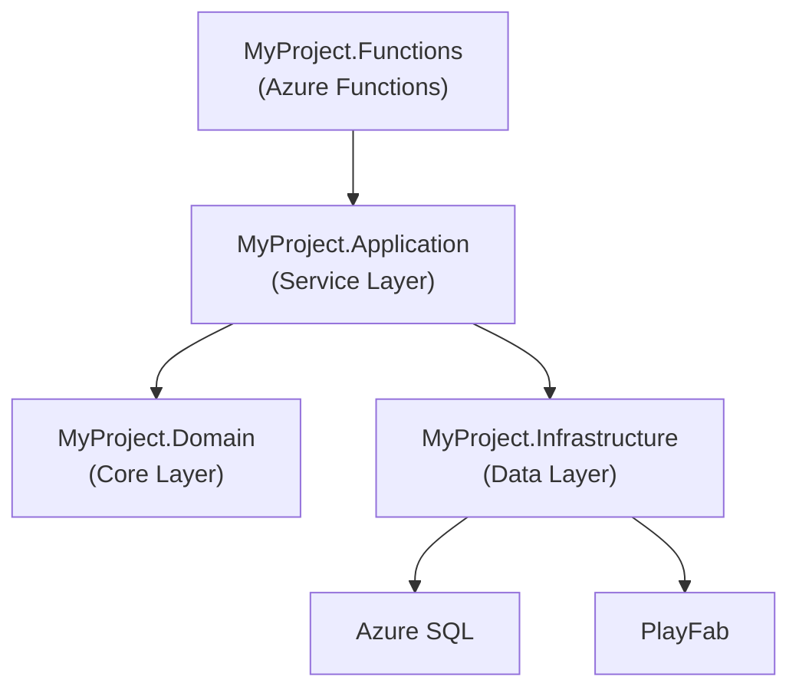
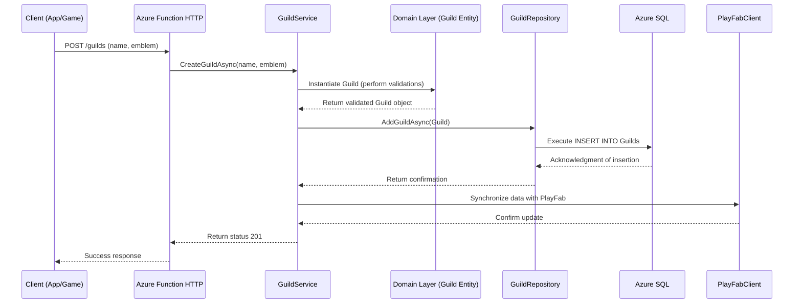
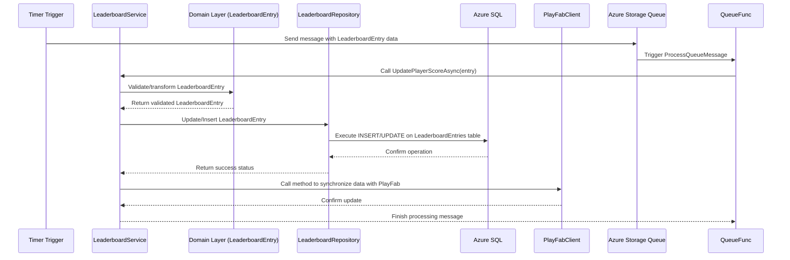
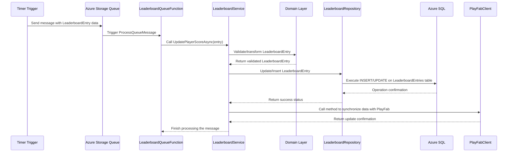

# Development of Guild/Clan Management Components and Leaderboards in a Game BaaS Platform with .NET 8 and Azure

This article aims to deeply and practically address the submodules of **Guild/Clan Management** and **Leaderboards** that make up a social module within a Game BaaS (Backend as a Service) platform. In this content, we will cover everything from the fundamental concepts and architecture of a distributed system using .NET 8, Azure Functions, Timer Trigger, PlayFab, and Azure SQL with Dapper, to the practical implementation of source code in C#. This document is intended for those who want to understand both the fundamentals and best practices for developing and integrating these components in a serverless backend environment.

Throughout this article, we will discuss the advantages and disadvantages of each approach, provide real code examples, and illustrate flows and architectures using Mermaid diagrams to facilitate the visualization of processes and interactions between components. We will emphasize the importance of using a layered architecture to promote separation of concerns and to facilitate system maintenance and scalability.

> **Note:** The functionality and features presented here are compatible with **.NET 8 or higher**. It is important to mention that many of these features were initially available starting in .NET 5 and have significantly evolved in subsequent versions, culminating in the robust capabilities of .NET 8.

---

## Introduction

In today’s gaming development landscape, the need for robust and scalable platforms to manage player experiences is becoming increasingly evident. Components such as **Guild/Clan Management** and **Leaderboards** are essential to foster social interaction, increase engagement, and encourage healthy competition among players.

In this article, we will discuss:

- The importance of social modules in Game BaaS platforms.
- How using .NET 8 and a serverless environment on Azure can transform the implementation of these features.
- The role of PlayFab as a solution for integrating with game services.
- How to manage and store data using Azure SQL and Dapper to ensure performance and scalability.

Furthermore, we will discuss the architecture of a distributed project structured in layers, highlighting the responsibilities of each layer and providing practical examples of code and execution flows.

---

## Context and Use Cases

Integrating the modules for Guild/Clan Management and Leaderboards into a Game BaaS platform allows developers to:

- **Foster Player Interaction:** By creating and managing guilds or clans, players can form communities, organize internal events, and compete in teams.
- **Encourage Competition:** Leaderboards serve as a performance gauge, recording top scores and promoting ongoing challenges.
- **Scale the System Efficiently:** Utilizing Azure Functions and a serverless architecture enables resources to scale on demand without managing physical or virtual servers.
- **Integrate Third-Party Services:** Using PlayFab allows for native integration with game services, making it easier to implement advanced features such as matchmaking, analytics, and inventory management.

### Use Cases

1. **Guild/Clan Creation and Management:**
   - **Creating Guilds/Clans:** Players can create and customize their guilds by defining names, emblems, and internal rules.
   - **Member Management:** Features to add, remove, or promote members, as well as set roles and permissions within the guild.
   - **Internal Events and Competitions:** Organizing guild-specific events with internal rankings and rewards.

2. **Leaderboard Implementation:**
   - **Global and Local Rankings:** Displaying the top players or teams in global, regional, or custom event leaderboards.
   - **Real-Time Updates:** Using Timer Trigger to periodically update leaderboard data.
   - **PlayFab Integration:** Synchronizing performance data and player statistics with PlayFab for enhanced analytics and matchmaking.

These scenarios demonstrate the need for a robust backend capable of handling high concurrency, low latency, and a scalable architecture to meet the demands of modern games.

---

## Concepts and Architecture

In this section, we will discuss the fundamental concepts behind developing components for Guild/Clan Management and Leaderboards, as well as present the layered architecture we will adopt to structure our project. The separation into layers makes the system easier to maintain, scale, and evolve, as each module focuses on specific responsibilities.

### Fundamentals

The key principles guiding the development of this system are:

- **Serverless and Azure Functions:** Using Azure Functions to execute tasks in a scalable, event-driven manner—for example, periodically updating leaderboards.
- **Timer Trigger:** An Azure Functions mechanism that allows functions to execute at predefined intervals, essential for updating rankings and statistics.
- **PlayFab:** A game backend platform that provides services such as player management, leaderboards, matchmaking, and more. Its integration enables a faster and more effective approach to implementing advanced gaming features.
- **Azure SQL and Dapper:** Utilizing Azure’s relational database to store critical information, with Dapper acting as a micro ORM to facilitate efficient and high-performance SQL query execution.

### Project Architecture: Layered Approach

To ensure a robust and organized implementation, we adopt the following layered structure:

- **MyProject.Functions (HTTP Interface):**  
  This layer is responsible for exposing HTTP endpoints and triggers (such as Timer Trigger) via Azure Functions. It serves as the entry point for external requests and orchestrates calls to business services.

- **MyProject.Application (Application / Service Layer):**  
  This layer contains the business rules and use cases of the application. It orchestrates operations between the domain and infrastructure, ensuring that business rules are properly applied.

- **MyProject.Domain (Domain / Core Layer):**  
  This layer contains the system’s entities, aggregates, and core business rules. It is the heart of the application, where fundamental logic is implemented independently of external technologies.

- **MyProject.Infrastructure (Infrastructure / Data Layer):**  
  Responsible for implementing data persistence mechanisms, communication with databases (such as Azure SQL), and integrations with external services (like PlayFab). Dapper is used in this layer for efficient CRUD operations.

Below is a Mermaid diagram illustrating the proposed architecture:



---

## Practical Example

In this section, we present a practical example of implementing the Guild/Clan Management and Leaderboards modules. The project structure follows the layered architecture described above. For clarity, the example is divided into code snippets with detailed explanations.

### 1. Project Structure

The project directory structure will be as follows:

```cmd
MyProject/
├── MyProject.Functions
│   ├── GuildFunctions.cs
│   └── LeaderboardFunctions.cs
├── MyProject.Application
│   └── Services
│       ├── GuildService.cs
│       └── LeaderboardService.cs
├── MyProject.Domain
│   └── Entities
│       ├── Guild.cs
│       ├── Member.cs
│       └── LeaderboardEntry.cs
├── MyProject.Infrastructure
│   └── Data
│       ├── GuildRepository.cs
│       ├── LeaderboardRepository.cs
│       ├── DatabaseContext.cs
│       └── PlayFabClient.cs
```

### 2. Domain Layer Implementation

#### 2.1. Entities

Below are examples of the entities for Guild and LeaderboardEntry:

```csharp
// MyProject.Domain/Entities/Guild.cs

namespace MyProject.Domain.Entities
{
    public class Guild
    {
        public Guid Id { get; set; }
        public string Name { get; set; }
        public string Emblem { get; set; }
        public List<Member> Members { get; set; } = new List<Member>();

        public Guild(Guid id, string name, string emblem)
        {
            Id = id;
            Name = name;
            Emblem = emblem;
        }

        public void AddMember(Member member)
        {
            // Domain validation and logic
            Members.Add(member);
        }
    }
}
```

```csharp
// MyProject.Domain/Entities/Member.cs

namespace MyProject.Domain.Entities
{
    public class Member
    {
        public Guid Id { get; set; }
        public string Username { get; set; }
        public string Role { get; set; } // e.g., Leader, Officer, Member

        public Member(Guid id, string username, string role)
        {
            Id = id;
            Username = username;
            Role = role;
        }
    }
}
```

```csharp
// MyProject.Domain/Entities/LeaderboardEntry.cs

namespace MyProject.Domain.Entities
{
    public class LeaderboardEntry
    {
        public Guid PlayerId { get; set; }
        public string Username { get; set; }
        public int Score { get; set; }
        public DateTime LastUpdated { get; set; }

        public LeaderboardEntry(Guid playerId, string username, int score, DateTime lastUpdated)
        {
            PlayerId = playerId;
            Username = username;
            Score = score;
            LastUpdated = lastUpdated;
        }
    }
}
```

### 3. Infrastructure Layer

In this layer, we implement communication with the Azure SQL Database using Dapper and integrate with the PlayFab API for game operations.

#### 3.1. Database Context

```csharp
// MyProject.Infrastructure/Data/DatabaseContext.cs

using System.Data.SqlClient;
using System.Data;

namespace MyProject.Infrastructure.Data
{
    public class DatabaseContext
    {
        private readonly string _connectionString;

        public DatabaseContext(string connectionString)
        {
            _connectionString = connectionString;
        }

        public IDbConnection CreateConnection()
        {
            return new SqlConnection(_connectionString);
        }
    }
}
```

#### 3.2. Guild Repository

```csharp
// MyProject.Infrastructure/Data/GuildRepository.cs

using Dapper;
using MyProject.Domain.Entities;
using System.Data;

namespace MyProject.Infrastructure.Data
{
    public class GuildRepository
    {
        private readonly DatabaseContext _dbContext;

        public GuildRepository(DatabaseContext dbContext)
        {
            _dbContext = dbContext;
        }

        public async Task<Guild> GetGuildAsync(Guid id)
        {
            using (IDbConnection db = _dbContext.CreateConnection())
            {
                string sql = "SELECT * FROM Guilds WHERE Id = @Id";
                return await db.QueryFirstOrDefaultAsync<Guild>(sql, new { Id = id });
            }
        }

        public async Task AddGuildAsync(Guild guild)
        {
            using (IDbConnection db = _dbContext.CreateConnection())
            {
                string sql = "INSERT INTO Guilds (Id, Name, Emblem) VALUES (@Id, @Name, @Emblem)";
                await db.ExecuteAsync(sql, guild);
            }
        }
    }
}
```

#### 3.3. Leaderboard Repository

```csharp
// MyProject.Infrastructure/Data/LeaderboardRepository.cs

using Dapper;
using MyProject.Domain.Entities;
using System.Data;

namespace MyProject.Infrastructure.Data
{
    public class LeaderboardRepository
    {
        private readonly DatabaseContext _dbContext;

        public LeaderboardRepository(DatabaseContext dbContext)
        {
            _dbContext = dbContext;
        }

        public async Task<IEnumerable<LeaderboardEntry>> GetTopPlayersAsync(int limit)
        {
            using (IDbConnection db = _dbContext.CreateConnection())
            {
                string sql = "SELECT TOP(@Limit) * FROM LeaderboardEntries ORDER BY Score DESC, LastUpdated ASC";
                return await db.QueryAsync<LeaderboardEntry>(sql, new { Limit = limit });
            }
        }

        public async Task UpdateLeaderboardEntryAsync(LeaderboardEntry entry)
        {
            using (IDbConnection db = _dbContext.CreateConnection())
            {
                string sql = @"
                    IF EXISTS (SELECT 1 FROM LeaderboardEntries WHERE PlayerId = @PlayerId)
                        UPDATE LeaderboardEntries SET Score = @Score, LastUpdated = @LastUpdated WHERE PlayerId = @PlayerId;
                    ELSE
                        INSERT INTO LeaderboardEntries (PlayerId, Username, Score, LastUpdated) VALUES (@PlayerId, @Username, @Score, @LastUpdated);";
                await db.ExecuteAsync(sql, entry);
            }
        }
    }
}
```

#### 3.4. PlayFab Integration

```csharp
// MyProject.Infrastructure/Integration/PlayFabClient.cs

using PlayFab;
using PlayFab.ClientModels;
using System;
using System.Threading.Tasks;

namespace MyProject.Infrastructure.Integration
{
    public class PlayFabClient
    {
        private readonly string _titleId;
        private readonly PlayFabApiSettings _apiSettings;

        public PlayFabClient(string titleId)
        {
            _titleId = titleId;
            _apiSettings = new PlayFabApiSettings { TitleId = _titleId };
            // Initialize PlayFab settings as needed
        }

        public async Task<GetLeaderboardResult> GetLeaderboardAsync(string statisticName, int maxResultsCount)
        {
            var request = new GetLeaderboardRequest
            {
                StatisticName = statisticName,
                MaxResultsCount = maxResultsCount
            };

            var tcs = new TaskCompletionSource<GetLeaderboardResult>();

            PlayFabClientAPI.GetLeaderboard(request, result =>
            {
                tcs.SetResult(result);
            },
            error =>
            {
                tcs.SetException(new Exception(error.GenerateErrorReport()));
            });

            return await tcs.Task;
        }
    }
}
```

### 4. Application Layer

The application layer implements the business logic and orchestrates operations between the domain and infrastructure layers.

#### 4.1. Guild Service

```csharp
// MyProject.Application/Services/GuildService.cs

using MyProject.Domain.Entities;
using MyProject.Infrastructure.Data;

namespace MyProject.Application.Services
{
    public class GuildService
    {
        private readonly GuildRepository _guildRepository;

        public GuildService(GuildRepository guildRepository)
        {
            _guildRepository = guildRepository;
        }

        public async Task CreateGuildAsync(string name, string emblem)
        {
            var guild = new Guild(Guid.NewGuid(), name, emblem);
            await _guildRepository.AddGuildAsync(guild);
        }

        public async Task<Guild> GetGuildAsync(Guid id)
        {
            return await _guildRepository.GetGuildAsync(id);
        }

        // Additional methods for managing members and domain rules
    }
}
```

#### 4.2. Leaderboard Service

```csharp
// MyProject.Application/Services/LeaderboardService.cs

using MyProject.Domain.Entities;
using MyProject.Infrastructure.Data;

namespace MyProject.Application.Services
{
    public class LeaderboardService
    {
        private readonly LeaderboardRepository _leaderboardRepository;

        public LeaderboardService(LeaderboardRepository leaderboardRepository)
        {
            _leaderboardRepository = leaderboardRepository;
        }

        public async Task<IEnumerable<LeaderboardEntry>> GetTopPlayersAsync(int limit)
        {
            return await _leaderboardRepository.GetTopPlayersAsync(limit);
        }

        public async Task UpdatePlayerScoreAsync(LeaderboardEntry entry)
        {
            await _leaderboardRepository.UpdateLeaderboardEntryAsync(entry);
        }
    }
}
```

### 5. Interface Layer (Azure Functions)

In this layer, we use Azure Functions to expose HTTP endpoints and triggers that allow execution of the operations defined above.

#### 5.1. Guild Functions

```csharp
// MyProject.Functions/GuildFunctions.cs

using System.Net;
using Microsoft.Azure.Functions.Worker;
using Microsoft.Azure.Functions.Worker.Http;
using MyProject.Application.Services;
using System.Text.Json;

namespace MyProject.Functions
{
    public class GuildFunctions
    {
        private readonly GuildService _guildService;

        public GuildFunctions(GuildService guildService)
        {
            _guildService = guildService;
        }

        [Function("CreateGuild")]
        public async Task<HttpResponseData> CreateGuild(
            [HttpTrigger(AuthorizationLevel.Function, "post", Route = "guilds")] HttpRequestData req)
        {
            var requestBody = await req.ReadAsStringAsync();
            var data = JsonSerializer.Deserialize<Dictionary<string, string>>(requestBody);

            if (data is null || !data.ContainsKey("name") || !data.ContainsKey("emblem"))
            {
                var badResponse = req.CreateResponse(HttpStatusCode.BadRequest);
                await badResponse.WriteStringAsync("Invalid data.");
                return badResponse;
            }

            await _guildService.CreateGuildAsync(data["name"], data["emblem"]);
            var response = req.CreateResponse(HttpStatusCode.Created);
            await response.WriteStringAsync("Guild created successfully.");
            return response;
        }
    }
}
```

#### 5.2. Leaderboard Functions with Timer Trigger

```csharp
// MyProject.Functions/LeaderboardFunctions.cs

using System.Net;
using Microsoft.Azure.Functions.Worker;
using Microsoft.Azure.Functions.Worker.Http;
using MyProject.Application.Services;
using MyProject.Domain.Entities;
using System.Text.Json;

namespace MyProject.Functions
{
    public class LeaderboardFunctions
    {
        private readonly LeaderboardService _leaderboardService;

        public LeaderboardFunctions(LeaderboardService leaderboardService)
        {
            _leaderboardService = leaderboardService;
        }

        [Function("GetLeaderboard")]
        public async Task<HttpResponseData> GetLeaderboard(
            [HttpTrigger(AuthorizationLevel.Function, "get", Route = "leaderboard")] HttpRequestData req)
        {
            var topPlayers = await _leaderboardService.GetTopPlayersAsync(10);
            var response = req.CreateResponse(HttpStatusCode.OK);
            await response.WriteStringAsync(JsonSerializer.Serialize(topPlayers));
            return response;
        }

        [Function("UpdateLeaderboard")]
        public async Task UpdateLeaderboard(
            [TimerTrigger("0 */5 * * * *")] TimerInfo timer)
        {
            // Example: update a fictitious player's score periodically
            var entry = new LeaderboardEntry(
                playerId: Guid.NewGuid(),
                username: "PlayerExample",
                score: new Random().Next(0, 1000),
                lastUpdated: DateTime.UtcNow);
            await _leaderboardService.UpdatePlayerScoreAsync(entry);
        }
    }
}
```

---

## Best Practices

Developing robust and scalable components for Game BaaS requires adopting several best practices spanning code organization, security, and scalability. Below are some recommendations:

### 1. Code Organization and Structure

- **Layered Architecture:**  
  Clearly separate responsibilities among the interface, application, domain, and infrastructure layers. This separation facilitates testing, maintenance, and scalability.

- **Naming Conventions:**  
  Use consistent naming conventions throughout the project. Classes, methods, and variables should have self-explanatory names.

- **Dependency Injection:**  
  Use dependency injection to decouple layers, improving testability and code evolution.

### 2. Specific Practices for Azure Functions and Serverless

- **Appropriate Triggers:**  
  Use Timer Triggers for periodic operations such as updating leaderboards. Ensure that the intervals are configured to match the game’s demand.

- **State Management:**  
  Since serverless functions are ephemeral, avoid storing state locally. Use external databases and caches for persistent information.

- **Scalability and Monitoring:**  
  Configure Application Insights and detailed logging to monitor function performance and identify bottlenecks.

### 3. Best Practices with PlayFab

- **Secure Integration:**  
  Use API keys and proper authentication when integrating with PlayFab to avoid exposing sensitive information.

- **Data Synchronization:**  
  Ensure that data synchronization between PlayFab and your database is handled asynchronously and resiliently, managing communication failures appropriately.

### 4. Using Dapper and Azure SQL

- **Optimized Queries:**  
  Write optimized SQL queries and use appropriate indexing to speed up read/write operations.

- **Connection and Transaction Management:**  
  Efficiently manage connections using `using` statements and ensure that transactions are properly handled to avoid inconsistencies.

- **Simple Mapping:**  
  Leverage Dapper’s simplicity to map database results directly to your entities, keeping the code clean and performant.

### 5. Advantages and Disadvantages of the Approaches

#### Azure Functions and Serverless

- **Advantages:**
  - Automatic scaling according to demand.
  - Lower operational costs, paying only for actual consumption.
  - Native integration with various Azure services.

- **Disadvantages:**
  - Cold start delays can affect performance in low-usage scenarios.
  - Maximum execution time limits for functions.

#### PlayFab

- **Advantages:**
  - A platform specialized for games, offering services like matchmaking, analytics, and player management.
  - Simplified integration with other services and SDKs.

- **Disadvantages:**
  - Dependency on a third-party solution, which may limit customization.
  - Variable costs based on usage and data volume.

#### Azure SQL with Dapper

- **Advantages:**
  - High performance in database operations.
  - Full control over SQL queries and data mapping.
  - Dapper’s simplicity avoids the overhead of more complex ORMs.

- **Disadvantages:**
  - Requires careful management of connections and transactions.
  - Fewer out-of-the-box features compared to full ORMs like Entity Framework.

### 6. Considerations on .NET 8

.NET 8 brings numerous improvements in performance, scalability, and support for new features that facilitate the development of serverless and distributed applications. Many functionalities initially available in .NET 5 have been significantly improved and enhanced in subsequent versions. Compatibility with .NET 8 or higher ensures that the system benefits from modern features and better integration with the Microsoft ecosystem.

---

## Final Thoughts

The development of components such as Guild/Clan Management and Leaderboards in a Game BaaS platform represents an exciting and rewarding challenge for developers looking to create scalable, high-performance, and secure solutions. By adopting a layered architecture using .NET 8, Azure Functions, PlayFab, and Azure SQL with Dapper, you can build a robust system that meets the demands of modern competitive games.

In this article, we have covered:

- The importance of social modules to engage and retain players.
- The structure of a distributed project and the separation of concerns across layers.
- Practical code examples that illustrate the creation and management of guilds, as well as the updating and querying of leaderboards.
- Best practices and considerations for each of the involved technologies, highlighting the advantages and disadvantages of each approach.

Integrating these components, when well planned and executed, can transform the player experience by providing a backend platform that is both robust and flexible, enabling rapid iteration and scalability as demand grows.

---

## References

- [Microsoft Docs: .NET 8](https://learn.microsoft.com/dotnet/core/whats-new/dotnet-8)  
- [Azure Functions Documentation](https://learn.microsoft.com/azure/azure-functions/)  
- [Timer Trigger for Azure Functions](https://learn.microsoft.com/azure/azure-functions/functions-bindings-timer?tabs=csharp)  
- [PlayFab Documentation](https://docs.microsoft.com/gaming/playfab/)  
- [Azure SQL Database Documentation](https://learn.microsoft.com/azure/azure-sql/)  
- [Dapper Documentation](https://github.com/DapperLib/Dapper)  
- [Layered Architecture in .NET](https://learn.microsoft.com/dotnet/architecture/modern-web-apps-azure/common-web-application-architectures)

---

## Appendix: Additional Diagrams and Flows

To help visualize data flows and the interactions between modules, below are additional diagrams that illustrate the integration between layers and the execution flow of functions.

### Guild Creation Process Flow Diagram



### Leaderboard Update Process Flow Diagram



---

## Advanced Considerations and Best Practices

### Critical Analysis of Components

#### Guild/Clan Management

The Guild/Clan Management module is responsible for creating and managing social structures within the game. Key operations include:

- **Guild/Clan Creation and Editing:**  
  Allows players to create organizations with unique identities.
- **Member Management:**  
  Includes features to add, remove, and update member roles, enforcing domain rules such as member limits and role hierarchies.
- **Internal Communication:**  
  Facilitates internal communication among members, enabling message sending and event organization.

**Advantages:**

- Enhances player engagement and retention.
- Provides a sense of community and healthy competition.

**Disadvantages:**

- Domain rule complexity may increase as the system evolves.
- Requires state management and synchronization across multiple services.

#### Leaderboards

Leaderboards are critical components in competitive games, as they record and display player scores, allowing comparisons of performance.

**Key Operations:**

- **Querying and Sorting:**  
  Lists the top players, supporting filters and segmentations (global, regional, or event-specific).
- **Real-Time Updates:**  
  Uses Timer Trigger to keep leaderboard data updated at regular intervals.
- **PlayFab Integration:**  
  Synchronizes performance data and statistics with PlayFab to enhance user experience.

**Advantages:**

- Encourages competitiveness and player engagement.
- Can be customized to suit various competition types and events.

**Disadvantages:**

- Frequent updates may cause load issues if not optimized.
- Data integrity and synchronization between multiple systems is critical.

### Scalability and Performance Considerations

Using Azure Functions in a serverless environment provides the advantage of automatic scaling; however, it is crucial to consider:

- **Cold Start:** Functions may experience delays after periods of inactivity. Warming strategies may be necessary for critical scenarios.
- **Connection Management:** When using Azure SQL and Dapper, ensure efficient connection handling to prevent resource leaks.
- **Caching:** Implement caching mechanisms for frequent reads to reduce database load.

### Integration with External Services

Integrating with PlayFab enables the system to leverage native gaming services such as matchmaking, analytics, and inventory management. However, it is essential to:

- **Secure API Keys and Tokens:** Manage them properly to avoid exposing sensitive information.
- **Monitor Latency and Availability:** Ensure that failures in PlayFab do not critically affect user experience.

### Testability and Maintainability

The separation into layers facilitates writing both unit and integration tests:

- **Unit Tests:**  
  Each layer, especially Domain and Application, should be tested in isolation to ensure correct implementation of business rules.
- **Integration Tests:**  
  Testing the communication between layers, particularly data persistence via Dapper, ensures the complete system functions as expected.
- **Mocking:**  
  Use mocking frameworks to simulate calls to external services (such as PlayFab) during tests, ensuring consistent system behavior.

---

## Case Studies and Advanced Examples

This section discusses a case study of a serverless backend project for a competitive multiplayer game where the Guild/Clan Management and Leaderboard components were integrated to support thousands of simultaneous players.

### Case Study Scenario

- **Competitive Multiplayer Game:**  
  An online game where players compete in quick matches and can join guilds for team-based competitions. Leaderboards are updated in real time to reflect individual and team performance.

- **Serverless Infrastructure:**  
  The platform uses Azure Functions for HTTP requests, periodic triggers, and integration with PlayFab. Data is stored in Azure SQL, with Dapper ensuring fast and efficient operations.

- **Challenges Faced:**  
  - High concurrency and dynamic scaling.
  - Data synchronization among multiple services (PlayFab, Azure SQL, and serverless functions).
  - Implementing complex business rules for guild management and leaderboard updates.

### Strategies Employed

1. **Horizontal Scalability:**  
   Configuring Azure Functions to automatically scale with demand, with appropriate timeout policies and warm-up strategies to mitigate cold start issues.

2. **Asynchronous Synchronization:**  
   Utilizing queues and messaging to ensure that leaderboard updates occur asynchronously and resiliently, decoupling the update from data querying.

3. **Monitoring and Logging:**  
   Implementing Application Insights to monitor function performance, identify bottlenecks, and ensure operation traceability.

4. **Security and Authentication:**  
   Protecting HTTP endpoints with API keys and token-based authentication to ensure that only authorized users can perform critical operations.

### Advanced Example: Asynchronous Leaderboard Update Using Queues

To illustrate an advanced approach, consider using an Azure Storage Queue to decouple the leaderboard update operation:

```csharp
// MyProject.Functions/LeaderboardQueueFunction.cs

using Microsoft.Azure.Functions.Worker;
using MyProject.Application.Services;
using MyProject.Domain.Entities;

namespace MyProject.Functions
{
    public class LeaderboardQueueFunction
    {
        private readonly LeaderboardService _leaderboardService;

        public LeaderboardQueueFunction(LeaderboardService leaderboardService)
        {
            _leaderboardService = leaderboardService;
        }

        [Function("ProcessLeaderboardQueue")]
        public async Task ProcessQueueMessage(
            [QueueTrigger("leaderboard-updates", Connection = "AzureWebJobsStorage")] string queueItem)
        {
            // Deserialize the queue item containing the player data
            var entry = System.Text.Json.JsonSerializer.Deserialize<LeaderboardEntry>(queueItem);
            if (entry != null)
            {
                await _leaderboardService.UpdatePlayerScoreAsync(entry);
            }
        }
    }
}
```

In this example, instead of updating the leaderboard directly from a Timer Trigger, a message is sent to a queue, and a separate function consumes that message to perform the update. This approach improves scalability and load balancing among multiple consumers.

#### Complete Sequence Diagram – Asynchronous Leaderboard Update with Queues



---

## Final Considerations

Implementing modules such as Guild/Clan Management and Leaderboards in a Game BaaS platform presents an engaging and enriching challenge for developers looking to create scalable, high-performance, and secure solutions. By adopting a layered architecture and using technologies such as .NET 8, Azure Functions, PlayFab, and Azure SQL with Dapper, you can build a robust system that meets the needs of modern competitive gaming.

This article has explored:

- The importance of social modules to engage and retain players.
- The structure of a distributed project and the separation of concerns across layers.
- Practical code examples illustrating the creation and management of guilds, as well as the update and querying of leaderboards.
- Best practices and considerations for each technology involved, highlighting the pros and cons of each approach.

When well planned and executed, the integration of these components can transform the gaming experience by providing a backend platform that is both robust and flexible, allowing rapid iteration and scalability as demand increases.

---

## References 2

- [Microsoft Docs: .NET 8](https://learn.microsoft.com/dotnet/core/whats-new/dotnet-8)  
- [Azure Queue Storage Documentation](https://learn.microsoft.com/en-us/azure/storage/queues/)  
- [Azure Functions Premium Plan – Advanced Scenarios](https://learn.microsoft.com/azure/azure-functions/functions-premium-plan)  
- [Architecting Serverless Applications on Azure – Best Practices](https://learn.microsoft.com/azure/architecture/serverless/)  

---

## Acknowledgements

This article and documentation were developed based on practices and experiences acquired from various serverless system projects. The content presented is intended to serve as a comprehensive and practical guide for advanced developers, helping build innovative and resilient Game BaaS platforms.

*Thank you to the Heimo Game Studio team for inspiring this work!  
Sincerely,  
Miqueias Mariano Guimarães*
