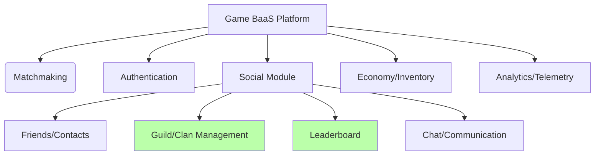

# Game Backend as a Service

## Introdução

Atualmente, muitos jogos online utilizam plataformas de **Backend as a Service (BaaS)** para delegar funcionalidades complexas do lado do servidor, como autenticação de jogadores, armazenamento de dados, matchmaking, etc. Esses serviços permitem que equipes de desenvolvimento foquem no core do gameplay, enquanto o BaaS oferece infraestrutura escalável, integrações com outros serviços e módulos prontos para uso.

Dentro de um BaaS para jogos, o **módulo “Social”** é responsável por proporcionar a interação entre jogadores, viabilizando listas de amigos, chat, ranking, criação de guilds ou clans e outras mecânicas que promovam engajamento. Em alguns casos, esse módulo é subdividido em serviços específicos, como o de **Guild/Clan Management** (para agrupar jogadores em equipes ou comunidades) e o de **Leaderboards** (para classificação e competitividade).

O fluxograma abaixo ilustra como esses submódulos se conectam no contexto geral de um Game BaaS, mostrando também outros módulos comuns em plataformas desse tipo.

### Estrutura do Game BaaS e Submódulos

### Explicação do Fluxograma

#### 1. Game BaaS Platform

- **Descrição**: Representa a plataforma de Backend-as-a-Service para jogos, onde se concentram vários módulos que suportam as funcionalidades de um game online (autenticação, matchmaking, dados de jogador, social, etc.).
- **Responsabilidade**: Agregar todos os serviços indispensáveis a um ambiente de jogo completo.

#### 2. Social Module

- **Descrição**: Módulo encarregado de funcionalidades sociais no jogo (relacionamentos entre usuários, grupos, comunicação).
- **Responsabilidade**: Servir de núcleo para todos os recursos de interação entre jogadores, incluindo gerenciamento de guilds/clans, leaderboard, lista de amigos, chat, etc.

#### 3. Guild/Clan Management

- **Descrição**: Submódulo que lida especificamente com a criação e organização de comunidades no jogo (guilds, clans, grupos), definindo regras de entrada, saída, convites, permissões, etc.
- **Responsabilidade**: Controlar a hierarquia e a administração das comunidades (clãs, guilds), armazenando informações de membros e status dentro do jogo.

#### 4. Leaderboard

- **Descrição**: Submódulo que cuida de toda a lógica de pontuação e classificação dos jogadores ou das guilds/clans.
- **Responsabilidade**: Calcular e exibir rankings de acordo com dados (como pontuação, conquistas, estatísticas). É um elemento crucial para incentivar a competitividade e engajamento.

#### 5. Friends/Contacts

- **Descrição**: Submódulo voltado ao gerenciamento de amizades, listas de contatos e conexões entre jogadores.
- **Responsabilidade**: Facilitar interações entre jogadores que queiram se adicionar como amigos, acompanhar status online/offline e enviar convites.

#### 6. Chat/Communication

- **Descrição**: Submódulo que provê recursos de mensagens (privadas ou em grupo), canais de discussão, possivelmente com suporte a voz ou chat em tempo real.
- **Responsabilidade**: Permitir aos jogadores se comunicarem facilmente, organizando estratégias, discussões ou conversas casuais.

#### 7. Authentication

- **Descrição**: Módulo para verificar e gerenciar a identidade de cada jogador, podendo integrar redes sociais ou provedores de login customizados.
- **Responsabilidade**: Garantir a segurança e identidade de cada usuário, servindo como base para que os demais módulos reconheçam quem está logado.

#### 8. Matchmaking

- **Descrição**: Módulo responsável por criar partidas entre jogadores de forma equilibrada (por nível, habilidades, região etc.).
- **Responsabilidade**: Reunir jogadores ou equipes para iniciarem um jogo (partida), analisando critérios e alocando recursos de servidor.

#### 9. Economy/Inventory

- **Descrição**: Módulo que controla a lógica de compras, moeda virtual, itens, inventário de jogadores e transações dentro do jogo.
- **Responsabilidade**: Gerenciar tudo relacionado ao sistema econômico do jogo, como saldo de moedas, aquisição de itens e upgrades.

#### 10. Analytics/Telemetry

- **Descrição**: Módulo que recolhe dados de uso, métricas de retenção, estatísticas de partidas, comportamento de jogadores, etc.
- **Responsabilidade**: Fornecer insights de uso e desempenho, auxiliando equipes de desenvolvimento e negócio na tomada de decisões.

---

## Observações Finais

1. **Guild/Clan Management** e **Leaderboard** estão diretamente ligados ao **módulo “Social”** porque tratam de relacionamentos e pontuações competitivas entre jogadores.
2. Em um **Game BaaS** completo, todos esses módulos (Social, Auth, Matchmaking, etc.) se integram para proporcionar uma experiência consistente ao jogador.
3. **O projeto da Parte 2** da Avaliação Técnica se enquadra principalmente como **Guild/Clan Management** + **Leaderboard**, funcionando como parte de um **Social Module** para uma plataforma de **Game BaaS**.
