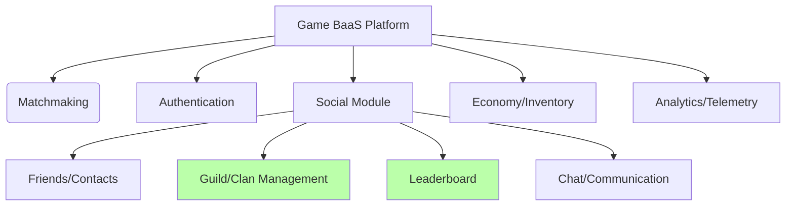

# Game Backend as a Service

## Introduction

Today, many online games use **Backend as a Service (BaaS)** platforms to offload complex server-side functionalities such as player authentication, data storage, matchmaking, and more. These services allow development teams to focus on the core gameplay while the BaaS provides scalable infrastructure, integrations with other services, and ready-to-use modules.

Within a Game BaaS, the **Social Module** is responsible for enabling player interaction by providing features like friends lists, chat, leaderboards, guild or clan creation, and other mechanics that drive engagement. In some cases, this module is subdivided into specific services such as **Guild/Clan Management** (for grouping players into teams or communities) and **Leaderboards** (for ranking and competitiveness).

The flowchart below illustrates how these submodules connect within the overall context of a Game BaaS, along with other common modules in such platforms.

### Game BaaS Structure and Submodules

### Flowchart Explanation

#### 1. Game BaaS Platform

- **Description:** Represents the Backend-as-a-Service platform for games, aggregating various modules that support the functionalities of an online game (authentication, matchmaking, player data, social, etc.).
- **Responsibility:** To aggregate all indispensable services for a complete gaming environment.

#### 2. Social Module

- **Description:** The module responsible for social functionalities within the game (user relationships, groups, communication).
- **Responsibility:** To serve as the core for all player interaction features, including guild/clan management, leaderboards, friends lists, chat, and more.

#### 3. Guild/Clan Management

- **Description:** A submodule that specifically handles the creation and organization of in-game communities (guilds, clans, groups), defining rules for entry, exit, invitations, permissions, etc.
- **Responsibility:** To control the hierarchy and administration of communities (guilds/clans), storing information about members and their status within the game.

#### 4. Leaderboard

- **Description:** A submodule that manages the scoring and ranking logic for players or guilds/clans.
- **Responsibility:** To calculate and display rankings based on data (such as score, achievements, statistics). It is a crucial element for fostering competitiveness and engagement.

#### 5. Friends/Contacts

- **Description:** A submodule focused on managing friendships, contact lists, and connections between players.
- **Responsibility:** To facilitate interactions between players who wish to add each other as friends, track online/offline status, and send invitations.

#### 6. Chat/Communication

- **Description:** A submodule that provides messaging features (private or group), discussion channels, and possibly support for real-time voice or chat.
- **Responsibility:** To enable easy communication among players for strategies, discussions, or casual conversation.

#### 7. Authentication

- **Description:** The module for verifying and managing each player's identity, possibly integrating with social networks or custom login providers.
- **Responsibility:** To ensure the security and identity of each user, serving as the foundation for all other modules to recognize the logged-in user.

#### 8. Matchmaking

- **Description:** The module responsible for creating balanced matches between players (by level, skills, region, etc.).
- **Responsibility:** To gather players or teams to start a game match, analyzing criteria and allocating server resources.

#### 9. Economy/Inventory

- **Description:** The module that handles the logic for purchases, virtual currency, items, player inventory, and in-game transactions.
- **Responsibility:** To manage everything related to the game's economic system, such as currency balance, item acquisition, and upgrades.

#### 10. Analytics/Telemetry

- **Description:** The module that collects usage data, retention metrics, match statistics, player behavior, etc.
- **Responsibility:** To provide insights on usage and performance, assisting development and business teams in decision-making.

---

## Final Observations

1. **Guild/Clan Management** and **Leaderboard** are directly connected to the **Social Module** because they deal with relationships and competitive scoring among players.
2. In a complete **Game BaaS**, all these modules (Social, Authentication, Matchmaking, etc.) integrate to provide a consistent player experience.
3. The Part 2 project in the technical evaluation primarily falls under **Guild/Clan Management** + **Leaderboard**, functioning as part of the **Social Module** for a Game BaaS platform.
