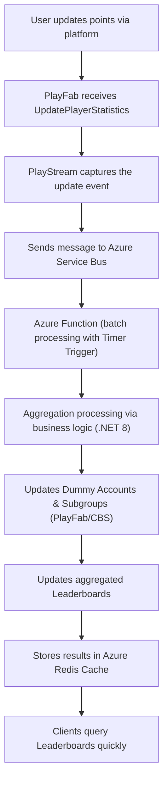
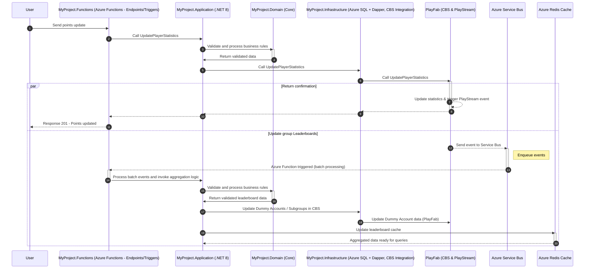

# Technical Proposal: Social Module – Guild/Clan Management and Leaderboards

This proposal aims to present a robust solution for the challenges of your project, which involves implementing two critical submodules—**Guild/Clan Management** and **Leaderboards**—within a Game BaaS platform. The architecture employs CBS (PlayFab), Azure Functions with Timer Trigger, .NET 8, and Azure SQL with Dapper, along with integrations with other Azure services (Service Bus, Redis Cache) to optimize costs, traffic, latency, and concurrency control.

---

## 1. Project Overview

- **Objective:**  
  Build a Social Module that manages guilds/clans and leaderboards in a scalable, low-latency manner—even in scenarios where groups (clans) can reach up to 30,000 players.

- **Context:**  
  Currently, PlayFab limits groups to 1,000 members. To meet the expectation of 30,000 members, the solution proposes:
  - **Dummy Accounts:** Dummy accounts represent aggregates (subgroups, clans, and communities) to enable aggregated leaderboard updates.
  - **Subgroups:** Creation of subgroups to partition a giant group into smaller segments, each with its own associations and custom identification fields.

- **Technological Platform:**  
  - **CBS (PlayFab):** For managing statistics and events (PlayStream).
  - **Azure Functions (with Timer Trigger):** For orchestration, batch processing, and asynchronous logic execution.
  - **.NET 8:** The language and framework for implementing business services.
  - **Azure SQL with Dapper:** For high-performance data persistence.
  - **Azure Service Bus:** For event queuing and reducing peak traffic.
  - **Azure Redis Cache:** For intelligent caching and reducing query latency.

---

## 2. Identified Issues

- **Member Limit in PlayFab:**  
  - PlayFab enforces a limit of 1,000 users per group.
  - There is a need to support up to 30,000 users per group.

- **Cloud Costs and Traffic:**  
  - A high volume of updates can increase traffic and the cost of direct calls to PlayFab and other services.
  - It is necessary to reduce direct calls and optimize data transfer between services.

- **Latency and Concurrency:**  
  - Asynchronous updates can introduce latency.
  - Concurrent updates require robust mechanisms to avoid conflicts and reprocessing, thereby increasing complexity.

---

## 3. Proposed Solution

### Data Aggregation and Ranking Approach

- **Dummy Accounts and Subgroups:**  
  - Partition a giant group (up to 30,000 players) into multiple smaller subgroups.
  - Each subgroup is represented by a dummy account whose aggregated statistic is used to compose the overall ranking for the clan/community.

- **Asynchronous and Batch Processing (Debouncing):**  
  - Use PlayStream to capture statistic update events.
  - Enqueue these events in the **Azure Service Bus** and process them in batches through **Azure Functions** with Timer Trigger, thereby minimizing repetitive calls to CloudScript.
  - Update dummy accounts and leaderboards in an aggregated manner.

- **Distributed Caching:**  
  - Implement **Azure Redis Cache** to temporarily store aggregated leaderboard results, reducing load on direct queries and improving latency.

- **Concurrency Control and Atomic Operations:**  
  - Adopt mechanisms (optimistic concurrency, versioning, and atomic commands in Redis) to ensure consistent updates and reduce unnecessary reprocessing.

### Strategies to Reduce Costs and Traffic

- **Fewer Executions:**  
  - Process data in batches to decrease calls to CloudScript and Service Bus.
- **Optimized Costs:**  
  - Leverage Azure Functions’ consumption model—only paying for what is used.
- **Reduced Traffic:**  
  - Centralize logic and use intelligent caching to minimize data transfers between services.
- **Better Concurrency Control:**  
  - Use atomic operations and versioning to prevent conflicts and unnecessary reprocessing.

---

## 4. Project Layered Architecture

The architecture adopts the **Layered Architecture** pattern:

- **MyProject.Functions (HTTP Interface/Triggers):**  
  - Exposes HTTP endpoints and triggers (e.g., Timer Trigger) via Azure Functions.  
  - Serves as the entry point for external requests and initial event orchestration.

- **MyProject.Application (Application/Service Layer):**  
  - Contains business rules and use cases.  
  - Orchestrates operations between the domain and infrastructure layers.

- **MyProject.Domain (Domain/Core Layer):**  
  - The core of the system with entities, aggregates, and domain rules.  
  - Implements fundamental business logic independently of external technologies.

- **MyProject.Infrastructure (Infrastructure/Data Layer):**  
  - Implements data persistence mechanisms (Azure SQL with Dapper) and integrations with external services (CBS/PlayFab, Azure Service Bus, Azure Redis Cache).  
  - Handles high-performance CRUD operations and external communication.

---

## 5. Ranking Update Flow – Flow Diagram

---

## 6. Complete Ranking Update Flow – Sequence Diagram

---

## 7. Conclusion

The proposed solution addresses the key challenges identified:

- **Overcoming the 1,000-User Limit per Group:**  
  By creating subgroups and dummy accounts, a giant group of up to 30,000 users can be partitioned while maintaining data integrity and facilitating aggregated ranking.

- **Reducing Costs and Traffic:**  
  Batch processing via Azure Functions, combined with the use of Azure Service Bus and Azure Redis Cache, minimizes direct calls to PlayFab and CloudScript, reducing operational costs and inter-service traffic.

- **Concurrency Control and Latency Management:**  
  Implementing atomic mechanisms and versioning strategies ensures data consistency, while asynchronous processing and intelligent caching minimize perceived latency.

- **Layered Architecture:**  
  Separating the system into Functions, Application, Domain, and Infrastructure layers promotes maintainability, scalability, and modularity—facilitating platform evolution and integration with new services as needed.

This technical proposal represents a scalable, efficient, and cost-effective solution for implementing the Guild/Clan Management and Leaderboards submodules, meeting the high-performance and data integrity requirements of your project.
