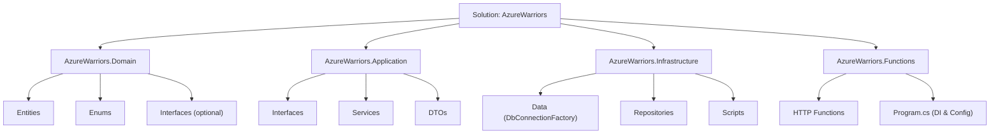

# AzureWarriors

AzureWarriors is a serverless system developed in **.NET 8** using **Azure Functions** to expose HTTP endpoints, **Dapper** for high-performance access to an **Azure SQL Database**, and a layered architecture to organize the project’s responsibilities. This system manages communities, clans, and invitations, with business rules such as:

- Each user can belong to only one community and one clan at a time.
- When a user switches communities/clans, their points are reset.
- Clans have a designated leader.

---

## Table of Contents

- [AzureWarriors](#azurewarriors)
  - [Table of Contents](#table-of-contents)
  - [Project Architecture](#project-architecture)
  - [Prerequisites](#prerequisites)
  - [Solution Structure](#solution-structure)
  - [Environment Configuration](#environment-configuration)
    - [Local Environment Variables](#local-environment-variables)
    - [Azure Configuration](#azure-configuration)
  - [How to Run Locally](#how-to-run-locally)
  - [Deployment to Azure](#deployment-to-azure)
  - [API Endpoints (Postman Collection)](#api-endpoints-postman-collection)
  - [Contact](#contact)

---

## Project Architecture

The project is organized into **four main layers**:

- **AzureWarriors.Domain:**  
  Contains the entities (Community, Clan, User, Invitation), enums (such as InvitationStatus), and optionally interfaces for marking aggregates. This layer represents the core of the domain.

- **AzureWarriors.Application:**  
  Contains the repository interfaces (to be implemented in the Infrastructure layer), services (CommunityService, ClanService, UserService, InvitationService) that orchestrate business rules, and DTOs for data transfer.

- **AzureWarriors.Infrastructure:**  
  Responsible for database access using Dapper. It includes the implementation of the repositories (CommunityRepository, ClanRepository, UserRepository, InvitationRepository), the connection factory (IDbConnectionFactory/DbConnectionFactory), and the SQL scripts for creating the schema.

- **AzureWarriors.Functions:**  
  The layer that exposes HTTP endpoints through Azure Functions (using the .NET Isolated Worker model). This layer injects the services from the Application layer and serves as the entry point of the system.

---

## Prerequisites

- **Visual Studio 2022** (or later) with support for .NET 8 and Azure Functions.
- **.NET 8 SDK** installed.
- **Azure Functions Core Tools** (for local execution and deployment).
- An **Azure account and subscription**.
- An instance of **Azure SQL Database** (or another SQL instance for testing).
- **Dapper** (via NuGet) for database access.
- Basic knowledge of **dependency injection** and **configuring Application Settings** in Azure.

---

## Solution Structure

The solution is organized as follows:

```cmd
AzureWarriors (Solution)
│
├── AzureWarriors.Domain
│   ├── Entities
│   │   ├── Community.cs
│   │   ├── Clan.cs
│   │   ├── User.cs
│   │   └── Invitation.cs
│   ├── Enums
│   │   └── InvitationStatus.cs
│   └── Interfaces (optional)
│
├── AzureWarriors.Application
│   ├── Interfaces
│   │   ├── ICommunityRepository.cs
│   │   ├── IClanRepository.cs
│   │   ├── IUserRepository.cs
│   │   └── IInvitationRepository.cs
│   ├── DTOs
│   │   └── CreateCommunityDto.cs
│   └── Services
│       ├── CommunityService.cs
│       ├── ClanService.cs
│       ├── UserService.cs
│       └── InvitationService.cs
│
├── AzureWarriors.Infrastructure
│   ├── Data
│   │   └── DbConnectionFactory.cs
│   ├── Repositories
│   │   ├── CommunityRepository.cs
│   │   ├── ClanRepository.cs
│   │   ├── UserRepository.cs
│   │   └── InvitationRepository.cs
│   └── Scripts
│       └── CreateTables.sql
│
└── AzureWarriors.Functions
    ├── Http
    │   ├── CommunityFunctions.cs
    │   ├── ClanFunctions.cs
    │   ├── InvitationFunctions.cs
    │   └── UserFunctions.cs
    ├── Configurations
    └── Program.cs
```

A flowchart representing the solution structure:



---

## Environment Configuration

### Local Environment Variables

In the development environment, use the `local.settings.json` file to configure your environment variables. Example:

```json
{
  "IsEncrypted": false,
  "Values": {
    "AzureWebJobsStorage": "UseDevelopmentStorage=true",
    "FUNCTIONS_WORKER_RUNTIME": "dotnet-isolated"
  },
  "ConnectionStrings": {
    "SqlConnection": "Server=tcp:YOUR_SERVER.database.windows.net,1433;Database=AzureWarriorsDB;User ID=YourUser;Password=YourPassword;Encrypt=True;TrustServerCertificate=False;Connection Timeout=30;"
  }
}
```

### Azure Configuration

1. **Function App:**  
   In the Azure Portal, open your Function App and go to **Configuration**.  
   - Add the connection string with the name `SqlConnection` under the **Connection Strings** or **Application Settings** section.

2. **Firewall and Access:**  
   Ensure that your environment's IP (or the "Allow Azure services" option) is enabled in the firewall of your Azure SQL Server.

---

## How to Run Locally

1. **Open the solution** in Visual Studio.
2. Ensure that the **AzureWarriors.Functions** project is set as the **Startup Project**.
3. Verify that the `local.settings.json` file contains the correct configurations.
4. Press **F5** or **Start Debugging** to launch the Azure Functions locally.
5. Use tools like **Postman** to test the endpoints at the URL:  
   `http://localhost:7071/api/{endpointName}`

---

## Deployment to Azure

1. **Configure** your Function App in the Azure Portal.
2. Use the **Publish** feature in Visual Studio:
   - Right-click the **AzureWarriors.Functions** project and select **Publish**.
   - Follow the wizard to deploy directly to Azure.
3. **Update** the Application Settings in the Portal to include the connection string and any other required variables.
4. After deployment, test the endpoints using your Function App URL, for example:  
   `https://yourapp.azurewebsites.net/api/CreateCommunity?code=YOUR_FUNCTION_KEY`

---

## API Endpoints (Postman Collection)

A Postman collection is provided to test the endpoints. Import the JSON file into Postman and adjust the base URL according to your environment (local or published).

---

## Contact

For questions or suggestions, please contact <miqueias.dev@gmail.com>.

---

*This document provides a comprehensive overview of the AzureWarriors project, including its architecture, solution structure, environment configuration, and deployment instructions—all in English.*
